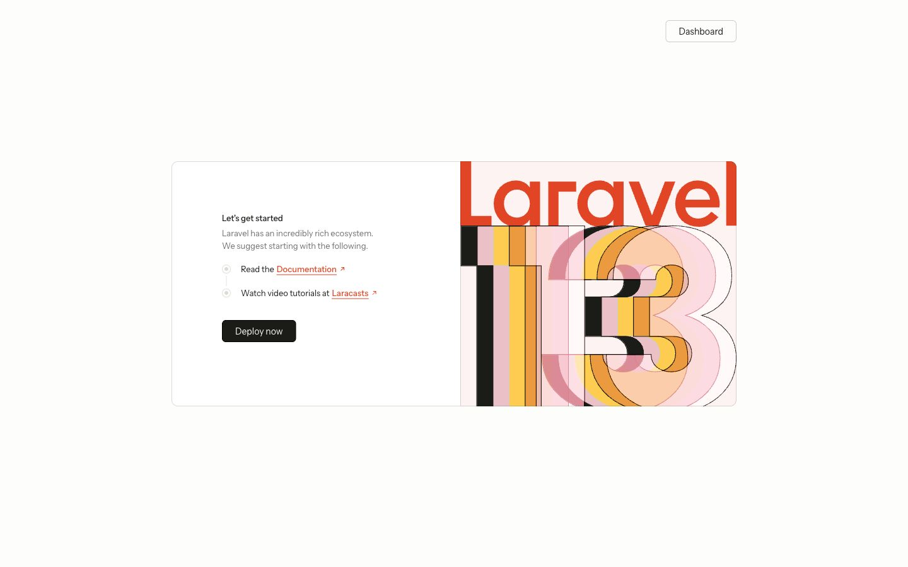
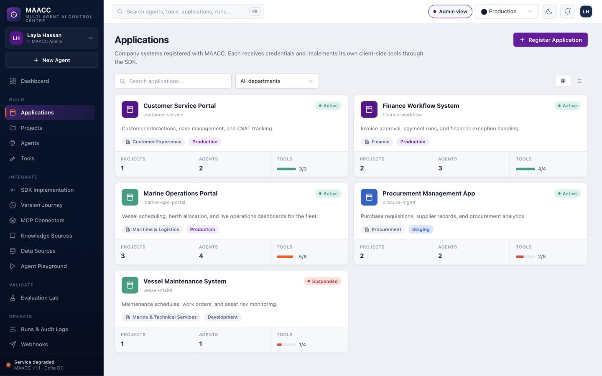
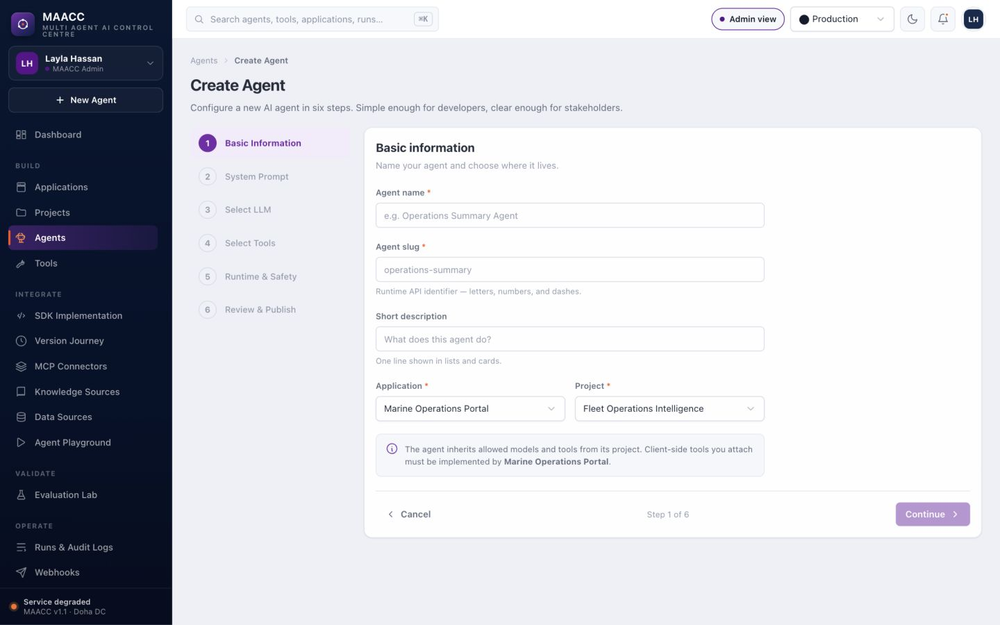
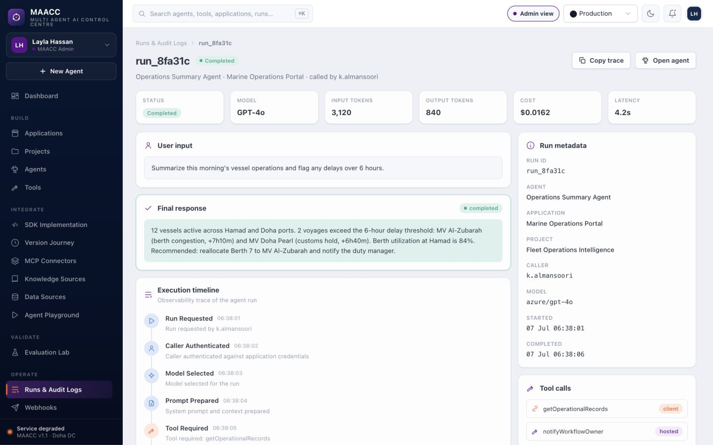
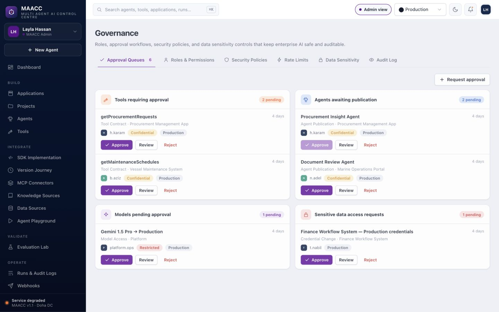
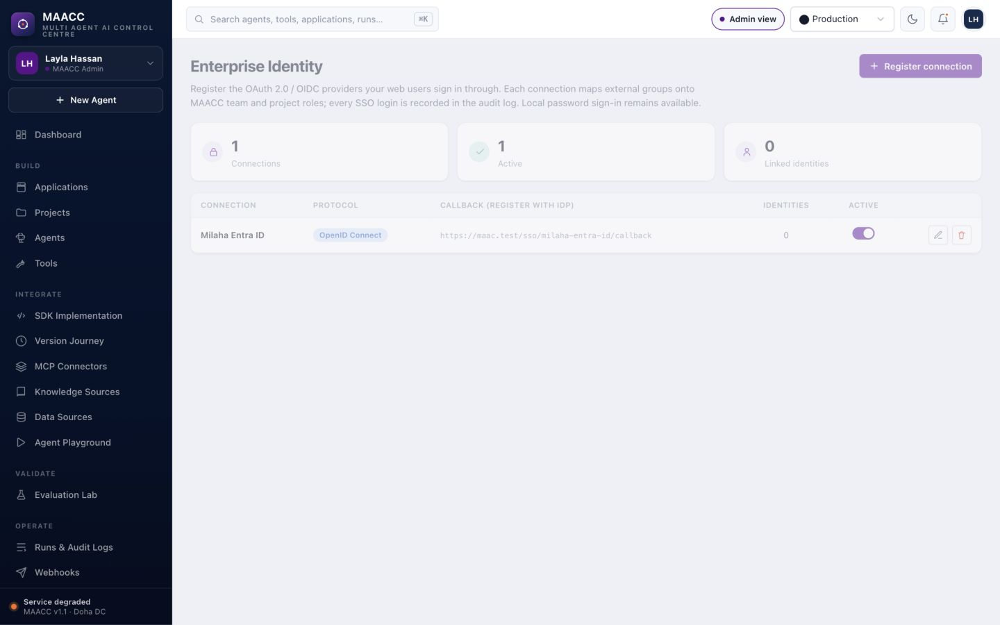
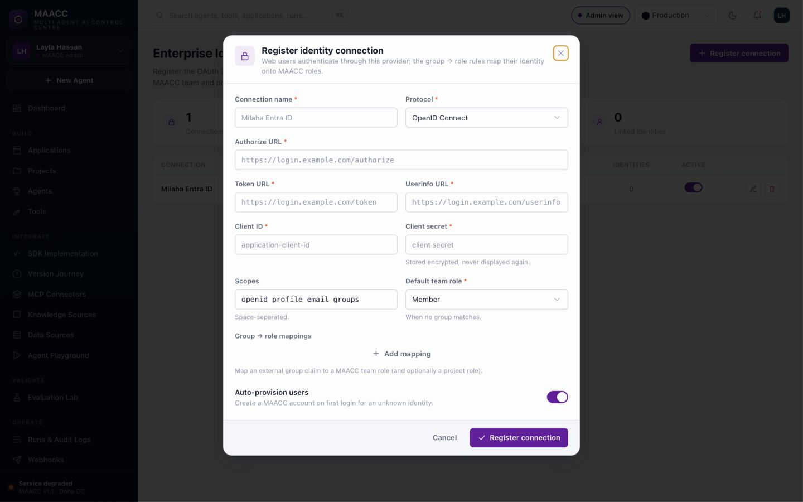
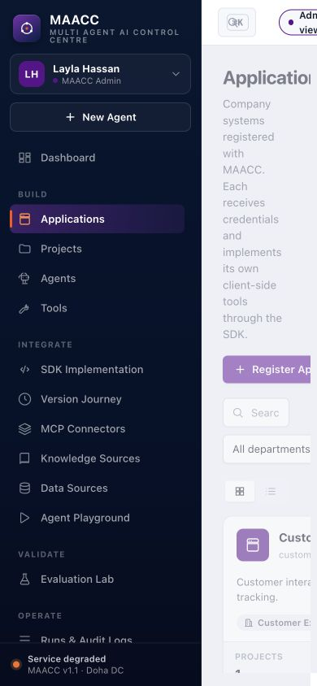

# MAACC Enterprise Readiness and BRS Conformance Review

**Review date:** 11 July 2026  
**Reviewed branch / revision:** `dev` at `a6684b96f614`  
**Primary acceptance baseline:** `docs/MAACC_BRS(1).md`  
**Supporting baselines:** `docs/MAACC_Architecture_Document.md`, `docs/MAACC_Phased_Implementation_Plan.md`, source code, migrations, tests, SDK packages, CI/CD workflows, and the running local console at `https://maac.test`  
**Decision:** **NO-GO for enterprise production or a real-data pilot**

## Contents

1. Executive conclusion and readiness scorecard
2. Scope, method, and strengths
3. Fifteen prioritized readiness gaps with closure gates
4. Full FR-001–FR-056 and NFR traceability
5. Success criteria and document contradictions
6. Live UI/UX evidence and forty edge cases
7. Database observations
8. Work packages, delivery waves, and estimates
9. Mandatory verification and enterprise acceptance gates
10. Revision verification results and evidence appendices

## 1. Executive conclusion

MAACC is a substantial working platform, not a prototype-only repository. The main application-to-agent-to-client-tool loop exists; credentials use Passport; PHP and TypeScript SDKs exist; all six execution modes are represented; runs, tool calls, traces, evaluations, approvals, quotas, retention, incident controls, SSO, model routing, and audit export have implementation and test coverage. The current suite passes **992 tests (989 passed, 3 skipped) with 4,701 assertions and 100.0% line coverage**, and PHPStan, TypeScript, SDK tests, SDK fixture checks, Composer audit, and npm audit are green.

Those strengths do not make the current build enterprise-ready. Several controls fail at trust boundaries rather than at feature-presence boundaries:

1. Management writes can link resources across tenants because related IDs are validated globally rather than under the authorized tenant/parent.
2. The SSO implementation trusts userinfo returned by a tenant-configured identity provider and links it to an existing global user by email without OIDC issuer/audience/nonce/signature/email-verification validation. Under the stated preconditions, this can become a global-account takeover path.
3. Masking can redact the display copy while raw prompts, conversation state, tool arguments, tool results, and final responses remain persisted elsewhere and may be copied into webhooks.
4. A vault key is written into process-global AI provider configuration and not restored; a later tenant request in the same long-lived worker can use the prior tenant's LLM credential.
5. Direct publication and runtime paths do not consistently apply the documented approval/readiness rules; disabled tools and suspended applications can remain invocable.
6. Tenant/platform authorization is only partly authoritative. The visible persona is a `localStorage` prototype, most pages receive the full tenant corpus, project membership administration is missing, and most platform permissions do not govern normal management policies.
7. The console is desktop-only at mobile widths, contains material keyboard/semantic/contrast defects, and shows several controls or readiness states that are local-only, hard-coded, dead, or inconsistent with the backend contract.
8. Operational evidence is insufficient for high availability, disaster recovery, capacity, performance, external secrets management, production SSO, SIEM integration, backup restoration, or safe progressive deployment.
9. The repository's aggregate CI gate is currently red because five frontend files fail Prettier, even though the functional and coverage suites are green.

The BRS implementation tally is:

| Scope                       | Implemented |    Partial | Not found / deferred | Total |
| --------------------------- | ----------: | ---------: | -------------------: | ----: |
| All functional requirements |  31 (55.4%) | 23 (41.1%) |             2 (3.6%) |    56 |
| Must Have requirements      |  26 (59.1%) | 16 (36.4%) |             2 (4.5%) |    44 |

This is an ID-count, not a weighted risk score. Several partial Must Haves contain release-blocking defects, so a weighted percentage would overstate readiness.

## 2. Readiness scorecard

| Domain                              | Rating    | Enterprise decision basis                                                                                                                                                     |
| ----------------------------------- | --------- | ----------------------------------------------------------------------------------------------------------------------------------------------------------------------------- |
| Core product workflow               | **Amber** | The end-to-end runtime and SDK workflow is real and well tested, but publication order, environment binding, tool readiness, and draft testing differ from the BRS.           |
| Tenant isolation                    | **Red**   | Related-resource IDs are not consistently tenant/parent scoped, enabling cross-tenant relationship injection when a foreign UUID is known.                                    |
| Identity and access                 | **Red**   | High-impact SSO trust flaw; project member management missing; prototype personas and incomplete platform-permission integration.                                             |
| Data protection and compliance      | **Red**   | Raw sensitive values persist outside the redacted display columns; webhooks may carry raw output/arguments; external vault and compliance decisions are not proven.           |
| Runtime governance                  | **Red**   | Direct publish bypasses the full readiness gate; suspended applications and disabled tools are not consistently rejected.                                                     |
| API/SDK contract                    | **Amber** | Two working SDKs and compatibility fixtures exist, but caller context, environment scoping, JSON schema, status semantics, and manifest rules drift from the BRS.             |
| Observability and audit             | **Amber** | Rich run/trace/audit coverage exists, but payload privacy, report correctness, user/department reporting, SIEM export, and internally consistent seed telemetry need closure. |
| Reliability and scale               | **Red**   | Queue/timeout/retry foundations exist; atomic quotas, proactive expiry, large-tenant pagination, load evidence, SLOs, HA, and DR proof do not.                                |
| UI/UX trust                         | **Red**   | Safety settings can be discarded, endpoints/history can be wrong, one-time secrets can be lost, and multiple controls claim behavior they do not perform.                     |
| Accessibility and responsive design | **Red**   | Confirmed desktop-only layout plus shared keyboard/semantic/contrast failures; no automated accessibility/browser suite.                                                      |
| Engineering quality                 | **Amber** | 100% line coverage, static analysis, and SDK checks are strong; line coverage does not exercise the missing invariants and current aggregate CI fails formatting.             |
| Release and operations              | **Red**   | Minimal `/up` verification, no artifact promotion/rollback evidence, nondeterministic Node install, over-privileged/mutating lint workflow, and no DR/restore evidence.       |
| Requirements governance             | **Red**   | BRS and architecture remain draft with unresolved decisions while the phased plan overstates completion of several controls.                                                  |

**Overall:** MAACC has a strong engineering foundation but is **not safe to expose to multiple real tenants or regulated/sensitive production data** until the P0 and P1 gates in this report are closed.

## 3. Review scope and method

### 3.1 Evidence reviewed

- Full repository inventory: 1,116 files (985 code, 119 documentation, 1 paper, 11 images); six sensitive files were intentionally excluded from graph content.
- Application graph: 3,014 nodes, 5,621 edges, and 255 communities after parsing `app/`; used to trace high-coupling runtime, controller, model, governance, and SDK paths. See the [generated graph report](../graphify-out/GRAPH_REPORT.md) and [interactive graph](../graphify-out/graph.html).
- BRS traceability: every `FR-001` through `FR-056`, the ten NFR categories, roles, tool/run status models, data-isolation requirements, reporting expectations, initial-release recommendation, and success criteria.
- Static code review: routes, middleware, requests, policies, actions, models, migrations, runtime, SSO, secrets, webhooks, queues, scheduled commands, Inertia data sharing, UI primitives, and representative screens.
- Live browser walkthrough: public entry, dashboard, applications, agents, create-agent wizard, tools, playground, runs, run detail, governance, roles, identity, access control, incidents, vault, SSO form, settings, and mobile layout.
- Read-only database checks: the local dataset has one team, five applications, eight projects, nine agents, and twelve runs. No existing cross-tenant mismatches can appear in a one-tenant dataset; the vulnerability is in prospective write invariants.
- Verification: build, tests, coverage, static analysis, TypeScript checks, SDK tests, SDK fixtures, package audits, and current formatting gate.

### 3.2 Interpretation rules

- **Implemented** means the requirement's intended behavior is enforced by authoritative code and has relevant test evidence.
- **Partial** means a surface exists but an invariant, workflow, contract detail, role, environment, or acceptance outcome is incomplete or contradicted.
- **Not found / deferred** means no production workflow satisfying the requirement was found.
- **Confirmed defect** means it is directly supported by code, browser, database, or command evidence.
- **Not proven** means the repository cannot establish an enterprise control that may exist outside the checkout; it should not be read as proof that production lacks it.
- Seed/demo telemetry inconsistencies are treated as operator-trust defects, not proof of production data corruption.
- **P0/P1/P2 are execution priorities, not CVSS labels:** P0 needs immediate containment or blocks all real-data release; P1 must close before a controlled pilot; P2 is important hardening that can follow the trust-boundary work. Security severity is stated separately where calibrated.

### 3.3 Limitations

- This was a local review, not a penetration test against a production deployment.
- No second live tenant or production identity provider was available; cross-tenant and SSO attack paths were validated statically from entrypoint to sink.
- No destructive writes were made to prove vulnerabilities against the local database.
- HA, backups, restore, WAF, network policies, external vault, SIEM, queue supervisors, and cloud topology cannot be certified from the repository alone.
- Accessibility findings combine live viewport evidence with static review; a full VoiceOver/manual WCAG conformance test remains an acceptance task.

## 4. What is already strong

- A coherent Laravel 13/Inertia 3 architecture with separated runtime, SDK, governance, secrets, routing, evaluation, and connector concerns.
- Passport client-credentials authentication, hashed application credentials, rotation/revocation, and application-scoped run lookups.
- PHP and TypeScript SDKs, version headers, shared fixtures, reference consumers, async polling, SSE, and typed missing-handler errors.
- Six tool execution branches: hosted, client, remote HTTP, MCP connector, knowledge retrieval, and governed database tools.
- Run, tool-call, trace, audit, evaluation, approval, quota, routing, retention, webhook, and incident models with extensive tests.
- Server-side model selection includes environment, sensitivity, health, cost, latency, and fallback considerations.
- Remote HTTP tools default closed when no host allowlist is configured; database tools default to an approved-connection list.
- Webhooks are HMAC-SHA256 signed with timestamp binding and stable delivery IDs.
- Secrets use encrypted casts and a `SecretVault` abstraction for LLM keys; an external implementation can be bound.
- Daily retention pruning and platform-access review are scheduled.
- Strong automated engineering baseline: PHPStan passes, TypeScript application and SDK checks pass, 30 Node SDK/reference tests pass, SDK fixtures pass, package audits report no known vulnerabilities, and Pest reports 100.0% line coverage.

These strengths should be preserved while the trust boundaries are repaired.

## 5. Release blockers and readiness gaps

### ER-01 — Cross-tenant relationship injection on management writes

**Priority:** P0 execution / High security severity / release blocker  
**Affected BRS:** FR-001, FR-008, FR-015, FR-018–020, FR-049, FR-054; data isolation  
**Status:** Confirmed by static entrypoint-to-sink trace

Several FormRequests use global `Rule::exists(...)` checks for relationship IDs:

- `app/Http/Requests/Maacc/StoreProjectRequest.php:19-29`
- `app/Http/Requests/Maacc/StoreAgentRequest.php:19-29`
- `app/Http/Requests/Maacc/UpdateAgentRequest.php:19-27`
- `app/Http/Requests/Maacc/StoreToolContractRequest.php:24-40`

The controllers authorize the current user, resource, or selected project but do not prove that every submitted related model belongs to the same tenant and approved parent. `SyncAgentTools` then creates assignments from supplied tool IDs without rechecking ownership (`app/Actions/Maacc/SyncAgentTools.php:16-27`). Database foreign keys prove existence, not same-tenant ownership; there are no composite tenant constraints.

With a foreign UUID, an authorized tenant user can potentially create a project under another tenant's application, associate an agent with another tenant's LLM provider, attach another tenant's tool/backing connector or data source, or create a locally-owned tool referencing another tenant's application. UUID unpredictability is not an authorization control.

**How to close**

1. Scope every related-ID validation query to the current team and selected parent.
2. Validate project/provider eligibility against the project's approved model pivot.
3. Validate tool eligibility by tenant, scope, application/project ownership, environment, active state, and agent assignment rules.
4. Authorize creation against the resolved parent model, not only the class/current team.
5. Centralize invariants in domain services so HTTP, console, jobs, imports, and future APIs share them.
6. Add database-level invariant protection where practical; otherwise use transactions plus explicit locked validation.
7. Add adversarial tenant-A/tenant-B tests for every relationship-bearing create/update action.

**Exit gate:** no management path can persist a tenant-mismatched application, project, provider, tool, connector, source, implementation, approval subject, or routing member; the adversarial test matrix is green.

### ER-02 — Tenant-configured SSO can link to an existing global account by unverified email

**Priority:** P0 execution / Critical security severity / release blocker  
**Affected BRS:** FR-049; enterprise identity; roles and permissions  
**Status:** Confirmed conditional attack path

This path is remotely reachable with near-public preconditions in the current configuration. Self-registration is enabled (`config/fortify.php:163-166`), registration creates a personal team whose user is Owner (`app/Actions/Fortify/CreateNewUser.php:34-42`; `app/Actions/Teams/CreateTeam.php:15-30`), and a team Owner is treated as the tenant MAACC Platform Admin allowed to create SSO connections (`app/Concerns/HasMaaccAccess.php:33-40`; `app/Policies/SsoConnectionPolicy.php:24-32`). All active connections across tenants are then advertised on the global login screen (`app/Providers/FortifyServiceProvider.php:120-135`).

`SsoAuthenticator` sends a nonce but does not persist or validate it, accepts an access token from arbitrary tenant-configured endpoints, and trusts the userinfo response without validating an OIDC ID token, provider signature/JWKS, issuer, audience, authorized party, nonce, expiry, or `email_verified` (`app/Support/Sso/SsoAuthenticator.php:20-29,37-71,90-108`). The callback validates only `sso.state`; it stores but does not verify `sso.connection`, and does not store the nonce (`app/Http/Controllers/SsoController.php:25-65`).

If no identity already exists for the connection/subject, `SsoUserResolver` selects any global user whose email matches the returned claim (`app/Support/Sso/SsoUserResolver.php:33-59`). It then signs that user in persistently, without a local MFA challenge, while retaining the user's existing global roles. A newly registered user can therefore create an attacker-controlled active IdP, assert the email of an existing MAACC administrator, and take over that account. Targeting Super Admin reaches the unrestricted `Gate::before` override. The attacker needs a verified ordinary account, a reachable token/userinfo service, and the victim email; **no victim interaction is required**. A passing test currently blesses email linking (`tests/Feature/Sso/SsoLoginTest.php:135-146`).

**How to close**

**Immediate containment:** disable or globally restrict tenant-created SSO connections; remove the global cross-tenant connection list; audit `sso_identities` for privileged users linked through unexpected connections; revoke suspicious sessions/links.

1. Restrict connection creation/activation to global platform security administrators and require a separate audited activation approval.
2. Use a standards-compliant OIDC authorization-code + PKCE client and validate signed ID tokens against pinned discovery/JWKS.
3. Pin and validate issuer, client audience, authorized party, signature algorithm, timestamps, nonce, state, and callback connection ID in a single-use transaction.
4. Require verified email and an approved email domain/tenant identifier where email is used.
5. Never auto-link an unrecognized external subject to an existing account by email. Require a pre-authenticated MFA-backed linking ceremony, globally approved pre-provisioning, or exact `(issuer, subject)` identity.
6. Separate tenant identity from global platform identity; disallow tenant IdPs from granting or linking platform administrators through tenant-admin configuration.
7. Authoritatively reconcile and revoke SSO-sourced roles when IdP groups are removed, without removing independent human grants.
8. Add replay, mix-up, unsigned-token, wrong issuer/audience/nonce/expiry, unverified-email, and privileged-email collision tests plus SSO rate limiting.
9. Add SSO test-before-enable, staged activation, and break-glass recovery runbooks.

**Exit gate:** an untrusted tenant IdP cannot authenticate, link, mutate, or inherit access to an existing user or platform role; all OIDC negative tests pass.

### ER-03 — Sensitive data can remain raw despite masking and exclusion settings

**Priority:** P0 execution / compliance blocker  
**Affected BRS:** FR-046, FR-055, FR-056; NFR Security, Observability, Compliance; data-isolation items 4–9  
**Status:** Confirmed

The runtime first persists the raw prompt in both `input` and `state.messages`, then only updates the `input` display copy with the redactor (`app/Support/Runtime/AgentRunner.php:86-118`). Tool arguments are stored raw (`:772-783`). Tool results are redacted in the `tool_calls.result` copy but appended raw to `state.messages` (`:801-828` and `:266-302`). Final output is stored raw in `output` and appended raw to state (`:845-853,961-967`).

The daily retention pruner eventually clears these fields after 30/90-day defaults, but that does not enforce a policy that says raw storage is blocked now (`app/Support/Governance/RetentionPruner.php:62-85`; `app/Models/GovernanceSetting.php:48-57`). Webhooks serialize `RunPayload`; completed responses and pending tool arguments can therefore leave the platform in raw form (`app/Support/Runtime/RunPayload.php:21-60`; `app/Support/Webhooks/WebhookPayload.php:22-28`).

**How to close**

1. Separate transient execution state from retained audit state. Put transient state in a short-lived encrypted store with explicit TTL, not the governed run record.
2. Apply the effective policy before every persistence and emission boundary: run input/output/state, tool arguments/results, traces, audit metadata, webhooks, exports, queue payloads, logs, and failed-job records.
3. Make `exclude` mean never persisted, not “deleted days later.”
4. Encrypt any permitted raw execution state with tenant-scoped keys and record access.
5. Redact errors and provider exception messages before storage/display.
6. Add sentinel tests that recursively inspect every database field, event payload, webhook, log, export, and queue serialization for prohibited values.
7. Finalize retention/default-storage decisions in the BRS and obtain Privacy/Security approval.

**Exit gate:** a restricted/confidential sentinel cannot be recovered from any prohibited persistence or outbound surface immediately after a run, during failure, or after retry.

### ER-04 — Publication and runtime do not share one authoritative readiness gate

**Priority:** P0 execution / release blocker  
**Affected BRS:** FR-008, FR-014–015, FR-023, FR-026, FR-036, FR-040, FR-052, FR-054  
**Status:** Confirmed

The approval workflow's `ApprovalGate` checks model availability, pending tool approvals, implementation status, connector/data-source readiness, and evaluation blockers (`app/Support/Governance/ApprovalGate.php:69-105`). Direct `AgentController::publish`, however, invokes only `EvaluationGate` before calling `PublishAgent` (`app/Http/Controllers/Maacc/AgentController.php:53-78`). More seriously, normal create/update validation accepts client-supplied agent `status`, and the actions persist it (`app/Http/Requests/Maacc/StoreAgentRequest.php:27`; `UpdateAgentRequest.php:25`; `app/Actions/Maacc/CreateAgent.php:31-50`; `UpdateAgent.php:29-34`). A Developer with Manage Agent but without Publish Agent can therefore submit `published` through the ordinary create/update path. The canonical E2E test also publishes before the client reports its tool implementation, contradicting the BRS readiness order.

Runtime authorization verifies that an agent is published and application-scoped, but does not bind the credential environment to the project/agent environment (`app/Support/Runtime/RunAuthorizer.php:23-39`). Tool definitions include all assigned tools without checking disabled/draft status (`app/Support/Runtime/AgentRunner.php:471-488`), and `handleToolCall` does not reject a disabled contract (`:505-536`). Material updates to tool endpoints/modes/sensitivity, model availability, connectors, knowledge/data sources, and credentials can remain active without invalidating or rebinding approval to an immutable configuration hash. Approval policy also permits a requester to decide their own request, and approval check/create/decision transitions lack a database uniqueness/row-lock invariant. `AuthenticateSdkClient` verifies the credential but not `Application.status`, while `IncidentGuard` checks only a runtime freeze (`app/Http/Middleware/AuthenticateSdkClient.php:34-56`; `app/Support/Governance/IncidentGuard.php:21-25`). A suspended application can therefore retain active runtime access.

**How to close**

1. Create one `AgentReadinessGate` used by direct publish, approval decisions, manifest exposure, playground/evaluation, and every runtime start/resume.
2. Require same-tenant/project-approved model, correct environment, active application/project/agent/tool, approved connectors/sources, compatible client implementations, required approvals, and passed evaluations.
3. Make status transitions a defined state machine; remove privileged statuses from ordinary create/update payloads.
4. Bind each approval to an immutable version/configuration hash, invalidate it on material change, enforce four-eyes separation, and lock decision rows with a unique pending-request invariant.
5. Stage production credential mutations and apply them only after approval rather than approving an already-applied action.
6. Reject suspended/archived applications at token/context middleware and again at runtime defense-in-depth.
7. Reject inactive/disabled tools before exposing them to the model and again before execution.
8. Add caller cancellation and scheduled expiration for abandoned waiting runs; emit exactly-once terminal events.
9. Add concurrency-safe transition, self-approval denial, and double-submit tests.

**Exit gate:** no route, job, approval, manifest, or runtime path can bypass the same reviewed readiness invariants.

### ER-05 — Long-lived workers can reuse another tenant's LLM API key

**Priority:** P0 execution / High security severity / release blocker  
**Affected BRS:** FR-013–017, FR-049, FR-054; NFR Security  
**Status:** Confirmed shared-state flaw

`LlmProvider::resolveApiKey` intentionally returns `null` when a catalog provider has no bound vault secret, causing the AI SDK to use environment/config credentials (`app/Models/LlmProvider.php:96-105`). When a vault key is present, `AiLlmRouter::applyVaultKey` mutates the process-global provider configuration and clears the memoized provider instance (`app/Support/Runtime/AiLlmRouter.php:89-105`). It does not restore the prior key after the call and does nothing when the next request's `apiKey` is `null`.

In a long-lived queue/Octane worker, a tenant-A run with a vault key can therefore leave that key in global configuration. A later tenant-B run using the same driver with environment fallback can be executed and billed through tenant A's provider account, sending tenant B's prompt under tenant A's credentials. The existing test explicitly expects the global config to remain changed and does not cover sequential tenants (`tests/Feature/Runtime/RuntimeSupportTest.php:66-79`).

**How to close**

1. Do not mutate shared application configuration for request/tenant credentials. Construct a request-scoped provider/client with the resolved key.
2. If the upstream SDK makes mutation unavoidable, snapshot and restore configuration in `finally`, and always forget the provider instance before and after every call, including null-key and exception/failover paths.
3. Prefer an explicit vault-bound credential for every tenant catalog provider; reserve environment fallback for a clearly platform-owned provider with no tenant billing boundary.
4. Review all other long-lived-worker mutable singletons/caches for tenant state.
5. Add sequential A-vault → B-config, A-vault → B-vault, exception, failover, retry, and concurrent-worker isolation tests.

**Exit gate:** two sequential or concurrent tenants can never observe, use, increment access for, or be billed through the other's provider credential.

### ER-06 — Authorization and data exposure are broader than the UI implies

**Priority:** P1 / required before multi-user pilot  
**Affected BRS:** FR-004, FR-049, roles and permissions  
**Status:** Confirmed

The visible tenant persona is explicitly a Phase 1 frontend mock, selected from hard-coded identities through `localStorage` and defaulting to Admin (`resources/js/maacc/personas.ts:1-4,152-228`; `resources/js/maacc/nav.tsx:188-209`). It controls presentation, not authoritative authorization. Only the Access Control navigation item has a platform permission flag.

Most MAACC pages are available to any authenticated team member; explicit Spatie permission middleware appears only on Access Control routes (`routes/web.php:43-178`). `HandleInertiaRequests` shares `auth.platform`, the current team, teams, and the full `MaaccConsoleData` corpus on every authenticated response (`app/Http/Middleware/HandleInertiaRequests.php:38-58`). That corpus includes unbounded runs and governance/enterprise collections and is filtered in the browser (`app/Support/MaaccConsoleData.php:32-36,146-194`). A user who should see one project can receive other tenant-project data in page props even when the UI hides it.

Project member/permission administration required by FR-004 has no production UI/API. Non-Super-Admin platform roles exist, but most normal management policies do not consult the corresponding global platform permissions.

**How to close**

1. Publish a route/action/data capability matrix for every tenant and platform role.
2. Make server-issued capabilities authoritative; remove production persona fixtures and `localStorage` authorization behavior.
3. Scope each page's data query to the user, project, environment, and permission; never ship hidden unauthorized records.
4. Add project membership assignment/revocation/expiry UI and API with audit events.
5. Decide and implement the documented cross-tenant remit of each platform role in policies and data queries.
6. Add page-prop, direct-URL, action, export, and object-level authorization tests for every role/no-role combination.

**Exit gate:** every page, prop, object, action, export, and navigation item produces the same least-privilege result for the same actor.

### ER-07 — Outbound webhook and remote-tool egress need enterprise SSRF controls

**Priority:** P1 / security hardening blocker  
**Affected BRS:** FR-052, FR-054; NFR Security  
**Status:** Confirmed control gap

An authenticated SDK client can self-register any syntactically valid HTTP/HTTPS webhook URL (`app/Http/Requests/Api/RegisterWebhookEndpointRequest.php:29-36`; `app/Http/Controllers/Api/V1/WebhookEndpointController.php:44-64`). `DeliverWebhook` posts to that URL without the remote-tool allow/deny guard or an IP-range check (`app/Jobs/DeliverWebhook.php:60-106`). This is a blind server-side request primitive and can target internal hosts; the fixed webhook body reduces but does not remove impact.

Remote HTTP tools do have a hostname allowlist, but `guardEgress` compares the textual hostname only and does not resolve/recheck all IPs or pin the destination through redirects, leaving private-IP DNS and rebinding/redirect hardening gaps (`app/Support/Runtime/Remote/RemoteHttpToolExecutor.php:49-65,124-140,186-228`).

**How to close**

1. Reuse one hardened outbound-request policy for webhooks, SSO endpoints, remote tools, connectors, and document fetchers.
2. Require HTTPS in production, approved domains where feasible, resolved-IP denial for loopback/private/link-local/metadata ranges, redirect revalidation, DNS rebinding resistance, and egress firewall enforcement.
3. Separate tenant-configurable destinations from infrastructure credentials and never forward sensitive headers across redirects/hosts.
4. Add safe destination verification and a test delivery before activation.
5. Add SSRF regression tests covering IPv4/IPv6 literals, alternative numeric encodings, DNS-to-private, redirects, userinfo, ports, and metadata endpoints.

**Exit gate:** no tenant-controlled URL can make MAACC reach a disallowed network destination, including after DNS resolution or redirect.

### ER-08 — BRS runtime and SDK contracts drift from implementation

**Priority:** P1  
**Affected BRS:** FR-003, FR-010, FR-021, FR-023–025, FR-028, FR-036, FR-040, FR-053  
**Status:** Confirmed

- BRS examples use standard nested JSON Schema; implementation intentionally uses a flat `field => type` dialect, validates only top-level primitive categories, ignores format hints, and permits undeclared fields (`app/Support/Sdk/ToolSchema.php:5-14,62-93`).
- The BRS calls for structured caller context and shows user/department context. The API accepts a single caller string and neither SDK `ToolContext` receives it nor the run response exposes it.
- `requires_tool` exists as an enum/documented status but is not persisted; the API contract pins `waiting_for_client`.
- Agent versions omit tools, sensitivity, runtime approval, routing, and other operative settings, so they cannot reproduce or roll back the full published configuration.
- Manifest discovery is not fully environment/project scoped; global client tools and true Not Required/Disabled derivation are incomplete.
- Draft agents cannot use the playground even though the BRS journey tests before publication.

**How to close**

1. Freeze the public v1 contract in an ADR and resolve each BRS/code disagreement.
2. Adopt full JSON Schema 2020-12 or formally specify/version the compact dialect; support nested objects, arrays/items, enums, bounds, formats, and `additionalProperties` policy.
3. Add a signed/minimized caller-context envelope to API, PHP SDK, TypeScript SDK, tool context, fixtures, and compatibility tests.
4. Version status changes with a migration/deprecation window.
5. Snapshot every execution-relevant agent/tool/routing policy field in an immutable version.
6. Correct manifest environment/scope/status semantics and add compatibility tests.

**Exit gate:** BRS, architecture, server fixtures, both SDKs, examples, and tests describe one versioned contract.

### ER-09 — Quotas and long-running lifecycle controls are not concurrency-safe enough

**Priority:** P1  
**Affected BRS:** FR-040; NFR Availability, Scalability, Reliability  
**Status:** Confirmed design gap

`QuotaGuard` performs a read/count or sum and the run is created afterward without a shared lock/reservation (`app/Support/Governance/QuotaGuard.php:31-39,47-59,81-95`). Concurrent requests can all observe capacity and exceed the limit. Async jobs have no explicit job-level tries, timeout, backoff, uniqueness, or failure handler (`app/Jobs/ProcessAgentRun.php`, `app/Jobs/AdvanceAgentRun.php`). Waiting-run expiration is lazy on later reads; no scheduled expiry sweep is registered in `routes/console.php`.

**How to close**

1. Make quota consumption atomic through Redis/Lua, a locked counter row, or a transactional reservation ledger with reconciliation.
2. Define queue-specific retry/backoff/timeout/idempotency/failure policies and poison-message handling.
3. Add scheduled run expiry, stale-approval cleanup, stuck-job detection, and exactly-once terminal transition guards.
4. Add per-client API rate limiting distinct from business quotas.
5. Exercise race, retry-after-crash, duplicate delivery, queue backlog, and partial-failure tests.

**Exit gate:** concurrency tests prove hard quota ceilings and idempotent lifecycle transitions under retries/crashes.

### ER-10 — Reporting and operator telemetry can be inaccurate or misleading

**Priority:** P1  
**Affected BRS:** FR-016, FR-043–048; reporting requirements  
**Status:** Confirmed

- `ModelPricing` explicitly computes USD while the dashboard labels the totals QAR; there is no governed conversion.
- Some provider usage/run counters are stored fixture-style rather than derived from run facts.
- The full tenant run collection is sent to the browser and chart/group calculations are client-side.
- Live run-detail evidence showed inconsistent timestamps: a displayed completion timestamp preceded later timeline events and the latency did not reconcile with the full timeline.
- The dashboard/side panel can state platform health from local console data rather than infrastructure/service probes.
- User/department reporting is impossible without the missing structured caller context.

**How to close**

1. Store currency with pricing/runs; display USD or convert with a governed, versioned rate and timestamp.
2. Derive all rollups from authoritative run facts/materialized aggregates; remove fixture counters from operational decisions.
3. Define timestamp/timezone semantics and reconcile trace/run/event completion atomically.
4. Separate application metrics from platform health; integrate queue, database, cache, storage, provider, scheduler, and worker telemetry.
5. Add metric reconciliation tests against known datasets and expose the calculation/source timestamp in UI.

**Exit gate:** finance, usage, latency, status, and health numbers reconcile to source facts and can be independently audited.

### ER-11 — Page data loading will not scale to enterprise tenant volumes

**Priority:** P1  
**Affected BRS:** NFR Performance and Scalability  
**Status:** Confirmed

Every authenticated Inertia response receives the shared MAACC corpus, and runs are loaded with an unbounded `->get()` before client-side filtering/rendering (`app/Support/MaaccConsoleData.php:146-150`). This increases database work, serialization cost, response size, browser memory, DOM rows, and data exposure as a tenant grows.

**How to close**

1. Replace global corpus sharing with page-scoped resources and authorized query objects.
2. Add cursor pagination and server-side filter/search/sort for runs, traces, audit events, tools, approvals, webhooks, and platform grants.
3. Use Inertia deferred/optional props and partial reloads for secondary panels.
4. Add appropriate compound indexes from measured query plans.
5. Set budgets for query count, response bytes, server latency, browser render time, and row count; test at 10k/100k-run fixtures.

**Exit gate:** representative high-volume pages meet approved p95 budgets without unauthorized or unbounded payloads.

### ER-12 — UI safety, action feedback, and state can misrepresent reality

**Priority:** P1  
**Affected BRS:** FR-011, FR-023, FR-026, FR-049, FR-056; NFR Usability  
**Status:** Confirmed

- The Create Agent wizard displays guardrails, production approval, and sensitive logging options, confirms them in Review, but omits them from the POST payload (`resources/js/pages/maacc/agents/create.tsx:589-611,835-838,890-905`).
- Agent detail displays hard-coded/local-only safety and runtime controls and documents an endpoint that does not match `routes/api.php`; its recent-run tab filters by application rather than agent.
- One-time credential and webhook secret dialogs clear the secret on any close path, including Escape/outside/X; clipboard success is shown without waiting for the Clipboard API result (`resources/js/components/maacc/credential-secret-gate.tsx:33`; `webhook-secret-gate.tsx:32`; `ui.tsx:1271,1455-1538`).
- Approval UI closes after dispatch without a confirmed success callback or robust duplicate-submit/error state.
- The global search is a decorative input; the environment selector persists only in `localStorage` and is not a global server filter.
- Confirmed dead controls include dashboard/runs exports, date range, copy trace, SDK re-validation, support links, and documentation actions. Some setup/health steps are hard-coded rather than telemetry-derived.
- Form state is not generally remembered and unsaved changes are not guarded; changing an application in the agent wizard can leave a stale project.

**How to close**

1. Remove or implement every visible affordance; never show a control or readiness claim without an authoritative action/source.
2. Persist or remove safety fields; validate every wizard step server-side and client-side; clear dependent selections.
3. Standardize mutation state: idle, confirmation, processing, success, recoverable error, retry; prevent double submission.
4. Make one-time secret dialogs non-dismissible until explicit acknowledgement and verified copy/manual selection.
5. Generate displayed API endpoints/examples from route/contract metadata.
6. Add dirty-state/navigation guards, correct empty/not-found/error/offline states, and absolute timezone-aware timestamps.

**Exit gate:** every primary and destructive action is authoritative, recoverable, and browser-tested across success, validation, authorization, network, and server failure.

### ER-13 — Mobile and accessibility acceptance fails on shared foundations

**Priority:** P1  
**Affected BRS:** NFR Usability; enterprise accessibility expectation  
**Status:** Confirmed by browser and static review

At 390×844 the permanent 248px sidebar leaves approximately 142px for main content; there is no drawer/hamburger or console breakpoint behavior. The layout uses a fixed `100vh` shell and fixed grids (`resources/js/layouts/maacc-layout.tsx:15-55`; `resources/js/components/maacc/sidebar.tsx:242-253`).

Shared primitives contain keyboard/semantic defects: clickable `div`/`tr` rows, clickable breadcrumb `span`s, tabs without tab semantics/relationships, toggles without switch semantics or accessible names, validation errors without `aria-invalid`/association/live regions, and custom menus without reliable focus/menu behavior (`resources/js/components/maacc/ui.tsx:367-401,500-542,607-697,821-842,1033`; `resources/js/maacc/forms.tsx:203`).

Confirmed token contrast failures include secondary text around 3.05:1 on white and 3.65:1 in dark mode, plus small teal/amber badges below 3:1 (`resources/css/app.css:173-182,205,247-257`). There is no component/browser/visual/accessibility test harness in `package.json`.

**How to close**

1. Repair shared primitives first using native/Radix semantics, accessible names, focus visibility/restoration, skip link, field-error association, keyboard row/card links, and arrow-key tabs.
2. Build a responsive shell using `100dvh`, collapsible/drawer navigation, breakpoint-aware grids, stacked actions/filters, modal reflow, and mobile table alternatives.
3. Replace color pairs with WCAG 2.2 AA-tested tokens in light/dark modes.
4. Add axe, keyboard, VoiceOver/manual, 200% zoom, reduced-motion, and screenshot regression gates at 320/375/768/1024/1440px.

**Exit gate:** the core workflows meet WCAG 2.2 AA and remain usable from 320–1440px and at 200% zoom.

### ER-14 — Production release, resilience, and supply-chain evidence is insufficient

**Priority:** P1  
**Affected BRS:** NFR Availability, Performance, Scalability, Reliability, Compliance  
**Status:** Confirmed repository gap / external controls not proven

- Live GitHub state on 11 July 2026 shows `hussain4real/AAC` is **public**. For an internal enterprise control plane this must be an explicit legal/security decision; if unintended, treat visibility and secret/session/key review as immediate containment. GitHub secret scanning and push protection are enabled, which is a positive control, but non-provider patterns/validity checks are disabled.
- The active `main` ruleset requires only `ci (8.4)` and `ci (8.5)`, allows zero approvals, does not require CODEOWNERS, last-push approval, or review-thread resolution, and does not require strict up-to-date checks. The linter is not required.
- GitHub reports zero deployment Environments, so the production workflow has no GitHub environment approval/protection surface.
- CI uses `npm i` rather than `npm ci`, weakening deterministic installs (`.github/workflows/tests.yml:45-49`).
- The lint workflow requests `contents: write` despite not needing it, runs mutating formatters, and does not fail on the resulting diff (`.github/workflows/lint.yml:17-45`).
- Deployment can exit successfully when secrets are absent, falls back to runtime `ssh-keyscan`, triggers an opaque server-side forced command, and checks only `https://maacc.app/up` for HTTP 200 (`.github/workflows/deploy.yml:37-73`).
- `/up` is only Laravel's framework health route; repository evidence does not show database/cache/queue/scheduler/storage/provider dependency checks, release identity, readiness vs liveness, canary/blue-green rollout, or automatic rollback (`bootstrap/app.php:16-22`).
- No SBOM, provenance/signing, secret scan, SAST, container/image scan, or dependency audit gate is present in CI, although the current local Composer/npm audits are clean.
- Dependabot covers GitHub Actions only; Composer/npm security updates are not configured and repository-level Dependabot security updates are disabled.
- The default project metadata still names the Laravel React starter kit (`composer.json:3-8`), and frontend titles can show “Laravel.”
- `.env.example` defaults to local/debug/SQLite/database queue/cache/local filesystem and does not provide a complete enterprise production checklist.
- No repository evidence proves load/capacity tests, SLOs, RPO/RTO, backup verification, restore drills, regional/zone redundancy, failover, queue supervision, scheduler monitoring, or disaster-recovery exercises.

**How to close**

1. Use frozen deterministic installs and fail CI if formatters change files.
2. Decide and document repository visibility; if public exposure was not explicitly approved, make it private and rotate/review every credential, signing key, webhook secret, SSO secret, deployment key, and production session issued under potentially exposed material.
3. Require at least one appropriate approval, CODEOWNER/security review for critical areas, resolved threads, strict current checks, linter/aggregate CI, and protected production environment approval.
4. Reduce workflow permissions to least privilege; add dependency audit/update coverage, secret scanning, SAST, SBOM/provenance and artifact signing as policy requires.
5. Build once and promote the same immutable artifact through controlled environments with approvals, release metadata, migration safety, canary/blue-green rollout, and rollback.
6. Split liveness, readiness, and deep dependency health; monitor workers, queues, failed jobs, scheduler heartbeat, database, cache, storage, providers, webhooks, and certificate expiry.
7. Define and test SLO/SLI, capacity, RPO/RTO, backups, restores, failover, and DR runbooks.
8. Bind an external KMS/vault implementation for production and prove key rotation/access logging.
9. Produce a hardened production configuration matrix; fail startup on unsafe production combinations.

**Exit gate:** a signed immutable release can be deployed, observed, rolled back, and restored under an approved runbook; resilience exercises meet signed SLO/RPO/RTO targets.

### ER-15 — The current aggregate CI gate is red despite green tests

**Priority:** P1 / merge and release gate  
**Status:** Confirmed on this revision

`composer ci:check` stops at `npm run format:check`. The current failing files are:

- `resources/js/components/maacc/credential-secret-gate.tsx`
- `resources/js/components/maacc/webhook-secret-gate.tsx`
- `resources/js/pages/maacc/evaluations.tsx`
- `resources/js/pages/maacc/sdk-docs.tsx`
- `resources/js/pages/maacc/webhooks.tsx`

The functional suite and coverage are green, but the release acceptance bar explicitly requires the aggregate control gate.

**How to close:** format the five files, run the full aggregate gate, and make CI formatter jobs non-mutating and diff-enforcing.

**Exit gate:** `composer ci:check` and the hosted required checks pass from a clean checkout with frozen dependencies.

## 6. Detailed BRS functional requirement traceability

### 6.1 Application and project management

| ID     | Priority | Result                   | Evidence, gap, and closure                                                                                                                                                                                                                                                 |
| ------ | -------- | ------------------------ | -------------------------------------------------------------------------------------------------------------------------------------------------------------------------------------------------------------------------------------------------------------------------- |
| FR-001 | Must     | **Implemented**          | Application/project creation routes, controllers, actions, policies, and feature tests exist. Preserve this path, but close ER-01 so every selected application/provider is tenant-scoped.                                                                                 |
| FR-002 | Must     | **Implemented**          | Passport-backed environment credentials, hashed secret storage, one-time display, and token issuance exist. The UI handoff needs the non-dismissible/verified-copy treatment in ER-12.                                                                                     |
| FR-003 | Should   | **Partial**              | Development/sandbox/staging/production values exist on credentials, apps, projects, implementations, and runs. Manifest/runtime authorization does not consistently bind the credential environment to the project/agent, and the global UI selector is not authoritative. |
| FR-004 | Must     | **Not found / deferred** | Project/member relationships and roles exist in the schema, but no owner-facing member assignment/revocation/permission workflow exists; SSO mapping is the only material writer. Build audited membership UI/API and role matrix.                                         |
| FR-005 | Must     | **Implemented**          | Credentials can be rotated and revoked, and issued Passport tokens are revoked. Application suspension itself is not enforced at runtime; close under ER-04.                                                                                                               |

### 6.2 Agent management

| ID     | Priority | Result                      | Evidence, gap, and closure                                                                                                                                                                                               |
| ------ | -------- | --------------------------- | ------------------------------------------------------------------------------------------------------------------------------------------------------------------------------------------------------------------------ |
| FR-006 | Must     | **Implemented**             | Agents are created under projects through authorized Laravel actions and tested management flows. Relationship validation still needs tenant/project invariants.                                                         |
| FR-007 | Must     | **Implemented**             | Server validation requires `system_prompt`; the wizard supports prompt/use-case capture. Add step-level validation and dirty-state protection.                                                                           |
| FR-008 | Must     | **Partial**                 | The UI presents approved/project models, but backend create/update rules accept any globally existing provider and routing does not enforce the project's model allowlist. Fix through ER-01/ER-04.                      |
| FR-009 | Must     | **Implemented with bypass** | Draft/published states and publication snapshots exist. Ordinary create/update can set `published`, bypassing Publish Agent authorization; remove status from ordinary writes.                                           |
| FR-010 | Should   | **Partial**                 | Versions capture prompt/model/temperature/token limit, but omit tools, sensitivity, approvals, routing, and other execution settings; updates are not fully reproducible or rollback-safe.                               |
| FR-011 | Should   | **Partial**                 | A real playground exists, including tool pause/resume, but draft agents are rejected even though the BRS journey tests before publication. UI has duplicate Run Agent actions and async reset/race gaps.                 |
| FR-012 | Must     | **Implemented**             | Published agents have a Passport-authenticated, application-scoped `/api/v1/agents/{agentSlug}/runs` endpoint. Agent detail displays a conflicting `/api/maacc/...` endpoint and must derive snippets from the contract. |

### 6.3 LLM management

| ID     | Priority | Result          | Evidence, gap, and closure                                                                                                                                                                                                         |
| ------ | -------- | --------------- | ---------------------------------------------------------------------------------------------------------------------------------------------------------------------------------------------------------------------------------- |
| FR-013 | Must     | **Implemented** | Catalog CRUD, verification, vault key resolution, promotion, routing, and tests exist. Production needs external vault/KMS proof and the worker key-isolation fix in ER-05.                                                        |
| FR-014 | Must     | **Partial**     | Draft/approved/deprecated/blocked states exist and routing checks availability. Catalog scope is tenant-team rather than unambiguously company-global, platform roles are not fully wired, and material edits can retain approval. |
| FR-015 | Should   | **Partial**     | A project/provider pivot exists and the UI writes allowlists, but agent management/runtime do not enforce it authoritatively.                                                                                                      |
| FR-016 | Must     | **Partial**     | Tokens and estimated cost are recorded. Pricing is USD while UI labels QAR; some provider counters are fixture-like and reporting is not fully derived/reconciled.                                                                 |
| FR-017 | Could    | **Implemented** | Routing strategies, environment/sensitivity/cost/latency/health filters, fallbacks, and trace decisions exist. Add provider-key isolation, atomic quotas, and production health/load proof.                                        |

### 6.4 Tool management

| ID     | Priority | Result          | Evidence, gap, and closure                                                                                                                                                                                             |
| ------ | -------- | --------------- | ---------------------------------------------------------------------------------------------------------------------------------------------------------------------------------------------------------------------- |
| FR-018 | Must     | **Partial**     | Global scope exists, but a project Developer with Manage Tool on any project can submit `scope=global`; tenant/platform admin ownership is not enforced.                                                               |
| FR-019 | Must     | **Partial**     | Project scope and `tool_assignments.project_id` exist, but normal creation does not capture a project and project association is not a complete production workflow.                                                   |
| FR-020 | Must     | **Implemented** | Agent-level assignments are persisted and exercised by E2E runtime tests. Close foreign-tool attachment, active-state, and approval invariants.                                                                        |
| FR-021 | Must     | **Partial**     | Name, schemas, mode, sensitivity, timeout, and payload limit are captured, but description is nullable and the schema is a proprietary flat dialect rather than the BRS JSON Schema.                                   |
| FR-022 | Must     | **Implemented** | Client-side contracts can be created/edited in the UI and consumed by SDK manifests. Schema-editor duplicate keys and accessibility need repair.                                                                       |
| FR-023 | Must     | **Partial**     | Required/implemented/outdated/incompatible states exist. Not Required/Disabled are not reliably derived from published-agent usage; global client tools can be omitted; environment scoping is incomplete.             |
| FR-024 | Must     | **Partial**     | Runtime checks top-level declared input fields/types, but arguments are stored before validation, undeclared fields pass, nested/format/enum/bounds rules are absent, and server-tool size checks are incomplete.      |
| FR-025 | Must     | **Partial**     | Client/server results are schema-checked, but undeclared fields pass, server-side result byte limits are incomplete, and raw duplicates can persist in state.                                                          |
| FR-026 | Should   | **Partial**     | Approval queues and dependency checks exist, but approval is user-selectable/bypassable, material edits do not always re-gate, self-approval/concurrency controls are weak, and direct publish bypasses the full gate. |

### 6.5 SDK integration

| ID     | Priority | Result          | Evidence, gap, and closure                                                                                                                                               |
| ------ | -------- | --------------- | ------------------------------------------------------------------------------------------------------------------------------------------------------------------------ |
| FR-027 | Must     | **Implemented** | PHP/TypeScript SDK authentication and token refresh/exchange exist with reference-app tests. Add per-client abuse controls and hardened production key handling.         |
| FR-028 | Must     | **Partial**     | Manifest discovery lists application agents/tools, but project/environment binding, global client tools, and implementation-state derivation do not fully match the BRS. |
| FR-029 | Must     | **Implemented** | Both SDKs invoke agents and expose synchronous/async primitives. Preserve shared fixtures and add idempotency/caller-context support.                                    |
| FR-030 | Must     | **Implemented** | Both SDKs register local tool handlers. Add strict contract projection and structured trusted context.                                                                   |
| FR-031 | Must     | **Implemented** | Simple mode handles pause/resume and missing handlers. Add concurrent/duplicate tool-result protection and scheduled expiry.                                             |
| FR-032 | Should   | **Implemented** | Advanced polling/SSE/custom handling exists. Add concurrent stream limits and worker/resource budgets.                                                                   |
| FR-033 | Must     | **Implemented** | SDK handler reporting and server reconciliation exist. Correct manifest Required/Not Required/Disabled rules.                                                            |
| FR-034 | Must     | **Implemented** | Typed missing-handler failures exist in both SDKs and reference tests. Ensure raw exception details do not leak.                                                         |

### 6.6 Agent runtime

| ID     | Priority | Result          | Evidence, gap, and closure                                                                                                                                                          |
| ------ | -------- | --------------- | ----------------------------------------------------------------------------------------------------------------------------------------------------------------------------------- |
| FR-035 | Must     | **Implemented** | Every invocation creates an AgentRun with lifecycle/traces. Add idempotency keys to avoid duplicate business runs on client retry.                                                  |
| FR-036 | Must     | **Partial**     | Required statuses exist in the enum, but `requires_tool` is not a persisted/public transition; `waiting_for_client` is the actual contract. Resolve and version the semantic drift. |
| FR-037 | Must     | **Implemented** | Client-side tool calls pause the run and persist a pending call. Transition locking/concurrent result submission still needs hardening.                                             |
| FR-038 | Must     | **Implemented** | Pending tool request includes ID, name, arguments, and output schema. Add caller context and minimize strictly to declared fields.                                                  |
| FR-039 | Must     | **Implemented** | Valid client results resume the loop; tests cover success and invalid results. Add idempotency/row locking and immediate masking.                                                   |
| FR-040 | Must     | **Partial**     | Runs expire on access after a deadline, but there is no proactive sweep; tool-specific wait semantics and exactly-once expiry notification are incomplete.                          |
| FR-041 | Must     | **Implemented** | Synchronous start-to-terminal/pause is available. Production timeouts/resource limits need SLO and load proof.                                                                      |
| FR-042 | Should   | **Implemented** | Queue-driven async execution and SSE streaming exist. Job retry/timeout/failure/idempotency controls and stream concurrency limits need closure.                                    |

### 6.7 Observability and audit

| ID     | Priority | Result          | Evidence, gap, and closure                                                                                                                                                       |
| ------ | -------- | --------------- | -------------------------------------------------------------------------------------------------------------------------------------------------------------------------------- |
| FR-043 | Must     | **Implemented** | Runs and lifecycle traces are persisted. Least-privilege read access and payload governance are incomplete.                                                                      |
| FR-044 | Must     | **Implemented** | Model, tokens, latency, cost, status, environment, and failure reason are recorded. Currency and timestamp reconciliation need correction.                                       |
| FR-045 | Must     | **Implemented** | Tool name, arguments, result, mode, sequence, and timing are recorded. Raw sensitive fields and concurrent sequence generation need hardening.                                   |
| FR-046 | Must     | **Partial**     | Per-team/environment retention and masking settings exist, but raw duplicate state/arguments/output and webhook emissions defeat the immediate policy.                           |
| FR-047 | Should   | **Partial**     | Dashboard aggregates exist, but project/agent/model reporting is not fully authoritative, user/department is absent, USD is labeled QAR, and large datasets are client-computed. |
| FR-048 | Should   | **Implemented** | Admin console can inspect run failures/traces. Data is currently over-shared to roles without a specific run/audit-read permission.                                              |

### 6.8 Security and governance

| ID     | Priority | Result                   | Evidence, gap, and closure                                                                                                                                                                                                                                                    |
| ------ | -------- | ------------------------ | ----------------------------------------------------------------------------------------------------------------------------------------------------------------------------------------------------------------------------------------------------------------------------- |
| FR-049 | Must     | **Partial**              | Tenant policies, roles, platform roles/permissions, access grants, and Super Admin override exist. Project membership is missing, page props are over-broad, platform roles are incompletely wired, persona UI is a mock, and SSO can inherit an existing user's global role. |
| FR-050 | Must     | **Implemented**          | Passport authenticates generated application credentials and binds an SDK context. Add runtime app-status checks, endpoint throttling, and per-caller authorization.                                                                                                          |
| FR-051 | Must     | **Implemented**          | Credential rotation revokes old access and issues a new one-time secret. Production approval semantics and secret-dialog recovery need closure.                                                                                                                               |
| FR-052 | Must     | **Partial**              | Credential revoke and incident freeze exist. `suspended`/`archived` application status is not consistently enforced in authentication/runtime.                                                                                                                                |
| FR-053 | Must     | **Not found / deferred** | Only a free-form caller string is accepted; trusted user/department/application context is not signed, returned, or delivered through PHP/TS `ToolContext`.                                                                                                                   |
| FR-054 | Must     | **Partial**              | Model/tool assignment, sensitivity, environment, egress, and approval controls exist, but foreign IDs, project allowlists, inactive tools/apps, material-change reapproval, and unified readiness are not enforced end-to-end.                                                |
| FR-055 | Should   | **Implemented**          | Tool/agent/model/run sensitivity exists and feeds routing, masking, and approvals. Immediate persistence/emission still violates the classification policy.                                                                                                                   |
| FR-056 | Should   | **Partial**              | Schemas, payload caps on some paths, egress restrictions, evaluation, and human approval exist. UI prompt/tool guardrail toggles are discarded/local-only, and no authoritative prompt-injection/content/action-risk guardrail engine was found.                              |

## 7. Non-functional requirements and enterprise proof

| BRS category    | Result               | Current evidence                                                                                                                                   | Required closure evidence                                                                                                                                                                 |
| --------------- | -------------------- | -------------------------------------------------------------------------------------------------------------------------------------------------- | ----------------------------------------------------------------------------------------------------------------------------------------------------------------------------------------- |
| Security        | **Partial / Red**    | Client-side tools keep application DB credentials out of MAACC; Passport, policies, schemas, egress controls, vault abstraction, and audits exist. | Close ER-01–ER-07, formal threat model/security assessment, tenant isolation tests, hardened egress, external key management, and production control sign-off.                            |
| Availability    | **Not proven / Red** | Async workers, timeouts, retries, and incident freeze exist.                                                                                       | Approved uptime SLO, redundant topology, readiness probes, queue/worker failover, provider degradation behavior, load/failover tests, and availability dashboard.                         |
| Performance     | **Not proven / Red** | Configured runtime/turn/stream timeouts and lightweight local screens.                                                                             | Measurable p50/p95/p99 budgets, load profiles by tool mode, 10k/100k console datasets, provider/tool latency budgets, and capacity report.                                                |
| Scalability     | **Partial / Red**    | Multi-tenant schema, queues, SDKs, and routing exist.                                                                                              | Remove global unbounded props; prove concurrency, quotas, queues, storage, DB indexes, backpressure, and noisy-neighbor isolation at target scale.                                        |
| Maintainability | **Strong / Amber**   | Clear domain separation, static analysis, 100% line coverage, two SDKs, fixtures, and reference apps.                                              | Add invariant/behavior/browser/accessibility/load tests; reduce 5,805-line `@ts-nocheck` public page; maintain traceability and operational docs.                                         |
| Observability   | **Partial / Amber**  | Rich run/tool/trace/audit records and dashboard aggregates.                                                                                        | Least-privilege access, safe payloads, SIEM/export integrity, scheduler/queue/dependency telemetry, metric reconciliation, SLO alerts, and correlation IDs.                               |
| Compliance      | **Partial / Red**    | Classification, retention settings, masking helpers, audit export, and access history exist.                                                       | Immediate no-store/masking enforcement, immutable/verifiably signed audit trail, legal hold, approved retention schedule, data inventory, privacy assessment, and restore/deletion proof. |
| Extensibility   | **Strong / Amber**   | Six execution modes, provider routing, SDK interfaces, vault and retriever abstractions.                                                           | Version contracts, sandbox third-party extensions, enforce tenant/runtime invariants at plugin boundaries, and publish compatibility policy.                                              |
| Reliability     | **Partial / Red**    | Controlled error types, timeouts, failover, webhook retries, quotas, and incident controls.                                                        | Atomic quotas/transitions, idempotency, proactive expiry, outbox, job policies, chaos/failure tests, backup restore, and runbooks.                                                        |
| Usability       | **Partial / Red**    | Broad IA and polished desktop visuals; tool implementation states and real forms exist.                                                            | Remove false/dead controls; repair mobile, accessibility, error/recovery/dirty states, project membership, draft test flow, and browser acceptance suite.                                 |

The BRS uses unmeasurable language such as “highly available” and “acceptable application UX limits.” These must become signed, testable targets before enterprise acceptance.

## 8. BRS success criteria assessment

| Success criterion                                                          | Result                       | Decision                                                                                                                                  |
| -------------------------------------------------------------------------- | ---------------------------- | ----------------------------------------------------------------------------------------------------------------------------------------- |
| Teams can create agents without separate AI infrastructure                 | **Met**                      | The management/runtime platform and SDKs provide this capability.                                                                         |
| Applications can securely call agents through SDK/API                      | **Partial**                  | Authentication works, but environment, tenant relationships, app status, worker key isolation, and abuse controls block a security claim. |
| Client tools access application-owned data without exposing DB credentials | **Met for the core pattern** | Local handlers keep DB access inside the application; governed DB mode is an additional server-side exception by design.                  |
| Developers can identify required tool implementations                      | **Partial**                  | Status surfaces exist, but Not Required/Disabled/global/environment semantics are incomplete.                                             |
| Runs are logged, auditable, and measurable                                 | **Partial**                  | Rich telemetry exists, but payload privacy, least-privilege access, currency, and export integrity are incomplete.                        |
| Approved LLM usage is centrally controlled                                 | **Partial**                  | Catalog/routing exist; project allowlists, status transitions, platform remit, and worker credential isolation are incomplete.            |
| Duplicate AI integration effort is reduced                                 | **Not verifiable**           | SDK/reference patterns support the intent, but repository evidence cannot measure organization-wide adoption/duplication.                 |
| Security teams can verify access boundaries and audit trails               | **Not met**                  | ER-01–ER-07 and mutable/checksum-only audit evidence prevent sign-off.                                                                    |
| Business teams consume AI inside existing applications                     | **Not verifiable**           | Requires a real external-application pilot and business acceptance evidence.                                                              |
| Platform scales across applications/projects                               | **Partial / not proven**     | The model supports it; performance, isolation, HA, capacity, and DR are not proven.                                                       |

### 8.1 Acceptance baseline risk

The BRS header remains **Draft for Review** and retains fourteen open questions (`docs/MAACC_BRS(1).md:727-745`), including identity provider, raw-result storage default, payload size, approval process, caller identity, retention, tool sharing, and environments. The architecture document is also draft. Implementation has necessarily made choices before the business/security baseline was finalized.

Before further feature work, convert the unresolved items into approved ADRs and update the BRS version/status. Otherwise “BRS complete” has no stable meaning.

### 8.2 Material plan/document contradictions

1. Phase 8B claims every management route, API action, policy, Inertia prop, and navigation item is permission-gated; only Access Control has explicit platform-permission middleware and full shared props remain broadly available.
2. Phase 5 claims prompt, response, tool-argument, and tool-result retention/masking; raw duplicate state, arguments, and outputs remain.
3. Phase 5 claims approval dependencies prevent unsafe publication; direct publish and client-settable status bypass them.
4. Phase 4/BRS use `requires_tool`; the actual public contract uses `waiting_for_client`.
5. BRS/architecture use JSON Schema; implementation uses a compact flat dialect.
6. BRS journey tests draft agents before publish; the playground rejects drafts.
7. Phase 6G claims enterprise SSO and vault completion; OIDC verification is incomplete, email linking is unsafe, and several integration secrets use encrypted database fields rather than the vault contract.
8. Phase 7 claims no dead console action buttons; multiple confirmed dead/local-only controls remain.
9. Phased status summaries repeatedly cite live browser coverage, but the repository contains no repeatable browser/component/accessibility suite; “browser coverage” often means Inertia page assertions plus a manual walkthrough.
10. Pricing code documents USD while the console labels QAR.
11. Phase 4 claims caller context enters runtime; structured context never reaches client-side handlers.
12. The plan's own documentation validation checklist at `docs/MAACC_Phased_Implementation_Plan.md:603-609` remains unchecked.

The plan should be changed from a historical “all complete” checklist into a release ledger that separates **built**, **tested**, **operationally proven**, and **accepted**.

## 9. Live UI/UX walkthrough

### 9.1 Entry and product identity

The public root route renders the stock Laravel welcome page rather than a MAACC entry, product overview, sign-in decision, or redirect (`routes/web.php:37`). At desktop width the page title/branding identify Laravel, not MAACC.

**Impact:** enterprise users, support, monitoring, and security scanners land on a surface unrelated to the product. The application name also leaks into page-title suffixes as “Laravel,” and `composer.json` still identifies the Laravel React starter kit.

**Closure:** establish the canonical entry behavior, MAACC naming, environment/release identity, legal/privacy/support links, and authenticated redirect. Remove starter-kit metadata before release.

### 9.2 Asset/deployment drift

The Applications route initially returned a 500 because the Vite manifest did not include `resources/js/pages/maacc/applications/index.tsx`. Running `npm run build` produced the missing assets and the page then rendered correctly. This is an artifact/deployment-state failure rather than a missing source implementation.

**Impact:** a source checkout/deployment can report healthy at `/up` while authenticated product routes fail. The current deploy health check would not catch this.

**Closure:** build one immutable artifact in CI; verify the manifest and representative authenticated route during readiness; promote that artifact rather than compiling in place after migration.

### 9.3 Create Agent flow

The six-step wizard is visually coherent and step navigation works, but its safety contract is unreliable: guardrails, production approval, and sensitive logging are displayed and reviewed but omitted from submission. Only the name gates initial progression; fixture defaults can be stale, changing application does not reset project, and unsaved progress has no navigation guard.

**Edge cases to close:** empty/whitespace prompt, unavailable model, cross-tenant UUID, project changed after selection, tool removed during wizard, duplicate submit, authorization loss mid-flow, browser back/refresh, network retry, draft test, and every safety toggle persisted/read back.

### 9.4 Operations and run investigation

The Runs and run-detail surfaces provide useful status, model, tokens, tool-call, timeline, and payload context.

The captured seed run showed a completion timestamp before later timeline events, while the displayed latency did not reconcile with the timeline. The UI also exposes prompt/output to any team member receiving the shared run resource. Date range, export logs, and copy trace controls are non-functional; timestamps omit a year and timezone.

**Closure:** reconcile terminal updates and trace order transactionally; provide ISO/absolute timestamps with locale rendering; permission-gate payload fields; make export/copy/filter authoritative; support empty, partial, loading, stale, failed, and very-large trace states.

### 9.5 Governance, identity, and secrets

Governance, role, approval, identity, incidents, vault, and access-control surfaces are broad and visually polished.

The UI breadth overstates the current enforcement. Approval feedback can close before confirmed success; SSO connections default toward active/auto-provision behavior without standards validation/test-before-enable; local password login remains available with no tenant SSO-only enforcement; one-time secrets are dismissible; and the visible role/persona is a frontend mock.

**Closure:** make activation and high-risk changes staged/approved; surface exact policy blockers; enforce SSO trust and tenant login policy; use non-dismissible secret acknowledgement; bind every role/action/data state to server capabilities.

### 9.6 Responsive failure

At 390×844 the fixed 248px sidebar remains permanently visible and the main pane is compressed to roughly 142px. Content is clipped and the primary workflow is not usable.

This is a release blocker for enterprise accessibility/responsive acceptance, including tablet, browser zoom, split-screen, and users with larger text settings.

### 9.7 Static UI quality score

The score below evaluates shared product foundations, not visual taste.

| Dimension              |           Score | Basis                                                                                                        |
| ---------------------- | --------------: | ------------------------------------------------------------------------------------------------------------ |
| Accessibility          |             1/4 | Systemic keyboard, semantic, labeling, focus, target-size, and contrast failures.                            |
| Performance            |             1/4 | Full tenant corpus on every response; unbounded/client-filtered run/tool tables.                             |
| Responsive             |             0/4 | Fixed desktop shell; no console viewport adaptations.                                                        |
| Theming                |             2/4 | Coherent tokens/dark mode, but failed contrast pairs and remote-font dependency.                             |
| Anti-pattern avoidance |             3/4 | Strong visual consistency, but prototype personas, dead actions, and false readiness/safety controls remain. |
| **Total**              | **7/20 — Poor** | The console looks more complete than its authoritative behavior and inclusive-use support.                   |

## 10. Additional logic, security, reliability, and UX edge cases

These findings are material but sit below the headline release blockers or are best closed inside the same work packages.

| Ref   | Priority | Edge case / gap                                                                   | Evidence and closure                                                                                                                                                                           |
| ----- | -------- | --------------------------------------------------------------------------------- | ---------------------------------------------------------------------------------------------------------------------------------------------------------------------------------------------- |
| EC-01 | P1       | Cross-tenant LLM key persists in long-lived process                               | Covered by ER-05. Also review model-provider instances during failover/exception and Octane/concurrent execution.                                                                              |
| EC-02 | P1       | Arguments are persisted before validation                                         | `AgentRunner` records a ToolCall before `ToolSchema::validatePayload`. Validate/project/size-check first, then persist the governed copy.                                                      |
| EC-03 | P1       | Server-tool outputs lack a uniform byte limit                                     | Client results enforce `max_payload_kb`; hosted/HTTP/MCP paths can decode/return large responses. Stream with bounded reads and enforce size before parse/persist.                             |
| EC-04 | P1       | Unknown schema properties pass through to tools                                   | A model can add undeclared flags such as `admin=true`; declare `additionalProperties` behavior and project only allowed fields before execution.                                               |
| EC-05 | P1       | Start-run retry has no idempotency key                                            | Client/network retry can create duplicate runs and spend. Accept an application-scoped idempotency key with request hash and stable replay response.                                           |
| EC-06 | P1       | Concurrent tool results can both resume                                           | Waiting-status/read/update/dispatch is not a row-locked compare-and-swap. Lock the run/call and allow one terminal acceptance.                                                                 |
| EC-07 | P1       | Queue visibility timeout is shorter than runtime timeout                          | Default queue `retry_after=90s` while run timeout is 120s; a job can be redelivered while the first worker is active. Set job timeout below retry-after with margin and add idempotent claims. |
| EC-08 | P1       | Runtime jobs lack explicit failure contract                                       | `ProcessAgentRun`/`AdvanceAgentRun` define no tries, timeout, backoff, uniqueness, or `failed()` state repair. Define per-job policies and stuck-run recovery.                                 |
| EC-09 | P1       | Sequence allocation uses `max + 1`                                                | Concurrent trace/tool writes can duplicate sequence because indexes are not unique. Use locked counters/unique constraints and retry conflicts.                                                |
| EC-10 | P1       | Quota counts configured rather than routed provider                               | Model quota matching can use the agent's default provider before the routing decision selects a fallback. Reserve against the selected provider and reconcile actual usage.                    |
| EC-11 | P1       | Subject IDs on quota/approval-like polymorphic controls need ownership validation | Validate subject type/ID against current tenant and allowed scope; reject dangling or foreign subjects.                                                                                        |
| EC-12 | P1       | DB statement timeout is stored but not applied                                    | Apply driver-specific statement timeout/transaction settings; tests should prove cancellation, cleanup, and safe error shape.                                                                  |
| EC-13 | P1       | Never-refreshed source may be treated as fresh                                    | If a freshness threshold exists, `data_refreshed_at=null` must be stale, not fresh.                                                                                                            |
| EC-14 | P1       | Raw provider/tool/database exception text reaches SDK/UI                          | Return stable public codes and correlation IDs; restrict detailed exceptions to secured telemetry.                                                                                             |
| EC-15 | P1       | Audit “signature” is a recomputable checksum                                      | SHA-256 beside the export detects accidental corruption only. Use HMAC/asymmetric signing with a managed key, or rename the claim; verify independently.                                       |
| EC-16 | P1       | Audit records are mutable/deletable in the operational DB                         | Model hooks miss bulk/quiet operations and retention deletes rows. Use append-only/WORM/SIEM outbox, protected DB role, legal hold, and hash chaining/signature as required.                   |
| EC-17 | P1       | SSO group removal does not revoke sourced platform/project access                 | Reconcile entitlements authoritatively by source while preserving independent grants; test removals and IdP outage.                                                                            |
| EC-18 | P1       | SSO endpoints lack dedicated throttling                                           | Add per-IP/connection/state throttles and anomaly alerts without enabling enumeration.                                                                                                         |
| EC-19 | P1       | All active tenant SSO options appear globally                                     | Scope login discovery to an approved tenant/domain/organization selection and do not reveal all customers/connections.                                                                         |
| EC-20 | P1       | MCP/SSO/webhook egress bypasses the remote-tool host guard                        | Covered by ER-07; centralize all outbound HTTP and add network egress controls.                                                                                                                |
| EC-21 | P1       | Knowledge upload/parser is synchronous and extension-led                          | Validate magic/MIME, quarantine/scan, cap pages/decompression/text/chunks, parse asynchronously in isolated workers, and avoid holding a DB transaction during extraction.                     |
| EC-22 | P1       | Console cache version is global across tenants                                    | High-frequency writes can invalidate/rebuild every tenant's broad corpus. Use team-scoped tags/versioning and event-driven aggregates.                                                         |
| EC-23 | P1       | Scheduled jobs can overlap/multiply                                               | Add `onOneServer()` and `withoutOverlapping()` where appropriate; monitor scheduler heartbeat and missed/long tasks.                                                                           |
| EC-24 | P1       | No proactive stale-run/webhook/passport/failed-job cleanup proof                  | Add reviewed schedules, bounded retention, dashboards, alerts, and runbooks for abandoned state.                                                                                               |
| EC-25 | P1       | Runtime API/SSE lacks transport abuse limits                                      | Add weighted per-client rate/concurrency limits, stream caps, gateway body/header/time limits, and backpressure.                                                                               |
| EC-26 | P1       | Caller is an untrusted label, not authorization context                           | Version/sign a minimized end-user envelope; applications enforce business authorization; tools receive trustworthy provenance.                                                                 |
| EC-27 | P2       | Duplicate tool schema keys silently overwrite                                     | Detect duplicate/empty keys in UI and server; preserve row identity and surface exact validation location.                                                                                     |
| EC-28 | P2       | Single-value chart can divide by zero                                             | `charts.tsx` uses `values.length - 1`; handle 0/1-point datasets explicitly and test invalid/NaN SVG output.                                                                                   |
| EC-29 | P2       | Empty and missing records have misleading states                                  | Tools/Runs can render empty table bodies; missing entities can show “screen being assembled” with 200. Use accessible empty states and 404/403 boundaries.                                     |
| EC-30 | P2       | Async Playground reset can be repainted by a late request                         | Cancel the Inertia v3 request or associate results with a request identity and current agent/environment.                                                                                      |
| EC-31 | P2       | One-time secret clipboard result is optimistic                                    | Await `navigator.clipboard.writeText`, expose permission failure/manual selection, and require explicit stored acknowledgement.                                                                |
| EC-32 | P2       | Approval UI lacks rejection rationale and robust stale-state handling             | Require/record rationale where policy needs it; handle 403/409/422/network failures and stale blockers without false success.                                                                  |
| EC-33 | P2       | Environment selector does not globally filter data                                | Either make it an authoritative server query dimension or label it as Playground-only; do not imply global scoping.                                                                            |
| EC-34 | P2       | Global search is decorative                                                       | Implement accessible federated search with authorization and keyboard behavior or remove it.                                                                                                   |
| EC-35 | P2       | Remote Google Fonts conflict with CSP/privacy/offline goals                       | Self-host approved fonts or use a safe system stack; fix the build warning caused by `@import` order.                                                                                          |
| EC-36 | P2       | Public landing page is 5,805 lines with `eslint-disable`/`@ts-nocheck`            | Split into typed components, bring it under lint/type coverage, and add visual/performance/accessibility tests.                                                                                |
| EC-37 | P2       | Session/DB defaults are unsafe if copied to production                            | Fail closed on secure cookies/session encryption, production debug, TLS verification, cache/queue/session stores, mailer, and key material.                                                    |
| EC-38 | P2       | Webhook delivery is at-least-once but consumer guidance is incomplete             | Document delivery-ID idempotency, duplicates/out-of-order events, signature tolerance, key rotation overlap, replay semantics, and retention.                                                  |
| EC-39 | P2       | Background jobs/audits can lack actor provenance                                  | Persist initiating user/application/correlation ID explicitly before dispatch; do not depend on request/auth state in workers.                                                                 |
| EC-40 | P2       | Demo tenant identity/slug/branding is inconsistent                                | Local team is “Layla Hassan's Team” at slug `carter-llc` while the dataset presents Milaha/MAAC. Seed coherent demo data and prevent fixture labels from reaching production.                  |

## 11. Database and current-data integrity observations

- The local database contains one team only, so cross-tenant integrity counts are zero by construction. This does **not** validate the write controls.
- Current counts: 1 team, 5 applications, 8 projects, 9 agents, 12 runs, 17 tool calls, and 12 audit events.
- No current project member has a null `maacc_role` in this dataset. `GovernanceConsoleData` nevertheless dereferences `$member->maacc_role->value` without a guard; old/imported/inconsistent data could cause a console failure and should be made defensive.
- No existing agent/provider or agent/tool tenant mismatch was found in the single-tenant seed data.
- Seed runs/tool calls currently do not contain populated raw state/arguments; the data-retention defect is confirmed from the runtime write path and should be tested with sentinel values, not dismissed by empty seed payloads.
- Critical tables have useful indexes, but there are no cross-table/composite ownership constraints capable of proving same-tenant relationships.

## 12. Execution plan

### 12.1 Planning assumptions

The indicative schedule assumes:

- 2 Laravel/backend engineers.
- 2 React/frontend engineers.
- 1 QA/SDET focused on automation and non-functional verification.
- 0.5–1 Security/IAM engineer.
- 0.5–1 Platform/SRE engineer.
- Product/BRS owner plus Privacy/Compliance and Accessibility reviewers at decision gates.

With that team, the work can run in parallel and is approximately **10–12 weeks to a controlled production pilot**, followed by pilot observation. With one or two engineers doing all streams, expect **16–24+ weeks**. These are planning ranges, not delivery commitments; Wave 0 should refine them after the BRS decisions and production topology are known.

### 12.2 Immediate containment: 0–48 hours

| Action                                                                                                                                              | Owner                  | Evidence of completion                                                   |
| --------------------------------------------------------------------------------------------------------------------------------------------------- | ---------------------- | ------------------------------------------------------------------------ |
| Freeze new tenant/real sensitive-data onboarding and label the current release non-enterprise.                                                      | Product + Security     | Change record and stakeholder notice.                                    |
| Disable tenant-created SSO or restrict connection creation/activation to global Security Administrators; remove the global connection list.         | Security/IAM + Backend | Configuration/authorization change, identity audit, negative login test. |
| Audit `sso_identities` and sessions for privileged emails linked through unexpected connections; revoke suspicious sessions/links.                  | Security/IAM           | Signed incident/audit record.                                            |
| Confirm whether public GitHub visibility is approved. If not, make private and initiate credential/key/session/history review and rotation.         | Security + Repo owner  | Approved decision or completed containment/rotation record.              |
| Add a fail-closed runtime guard for cross-tenant provider/tool/application relationships and suspended applications while full validation is built. | Backend                | Focused adversarial tests and deployment evidence.                       |
| Scan existing associations for tenant mismatch; quarantine any mismatch before rotating affected credentials.                                       | Backend + Security     | Read-only integrity report and remediation record.                       |
| Prevent ordinary agent create/update from setting Published; route promotion through the gate.                                                      | Backend                | Policy/state-transition tests.                                           |
| Stop shared provider-key leakage in workers by removing process-global key mutation or restoring it safely.                                         | Backend                | Sequential tenant-key isolation tests.                                   |
| Repair the five Prettier failures and make the full aggregate gate visible as required release status.                                              | Frontend + DevEx       | Green `composer ci:check` from clean checkout.                           |

### 12.3 Work packages

| WP    | Scope                                           | Primary owner                 | Dependencies                  | Definition of done                                                                                                                                                                                      |
| ----- | ----------------------------------------------- | ----------------------------- | ----------------------------- | ------------------------------------------------------------------------------------------------------------------------------------------------------------------------------------------------------- |
| WP-0  | Requirements freeze and threat model            | Product + Security            | None                          | BRS v1 approved; open questions resolved into ADRs; data classes, trust boundaries, environments, SLO/RPO/RTO, currency, retention, IdP, approval, schema, status, and caller-context decisions signed. |
| WP-1  | Tenant isolation and ownership invariants       | Backend + Security            | WP-0 ownership model          | All related IDs tenant/parent scoped; runtime defense-in-depth; data integrity scanner/migration; cross-tenant matrix green.                                                                            |
| WP-2  | OIDC/IAM and entitlement reconciliation         | Security/IAM + Backend        | WP-0 IdP/identity decisions   | Standards-compliant OIDC+PKCE; immutable issuer/subject; no email takeover; connection approval; SSO-source revocation; login discovery/throttling; negative suite green.                               |
| WP-3  | Data governance and secret isolation            | Backend + Privacy             | WP-0 retention/storage policy | No prohibited raw persistence/emission; ephemeral encrypted state; external vault/KMS; per-category deletion/legal hold; sentinel suite and key-isolation suite green.                                  |
| WP-4  | Unified state machine, approvals, and readiness | Backend + Product             | WP-1, WP-3                    | One version-bound gate for publish/approval/manifest/runtime; four-eyes; status cannot be client-set; inactive dependencies rejected; atomic transitions; credential mutations staged.                  |
| WP-5  | SDK/runtime contract correction                 | Backend + SDK owner           | WP-0, WP-4                    | Versioned schema/status/caller-context/environment/manifest contract; PHP/TS SDKs, fixtures, examples, migration guide, compatibility tests updated together.                                           |
| WP-6  | Authoritative RBAC and project administration   | Backend + Frontend            | WP-0, WP-1                    | Project membership UI/API; tenant/platform capability matrix; page/action/object/export/prop enforcement; no production personas; role matrix green.                                                    |
| WP-7  | Runtime reliability and egress                  | Backend + SRE + Security      | WP-1, WP-4                    | Atomic quota/idempotency/claims; job policies; outbox/terminal events; expiry/retry sweepers; unified SSRF guard; rate/concurrency limits; failure/race tests green.                                    |
| WP-8  | Console data architecture and reporting         | Backend + Frontend            | WP-6                          | Page-scoped/deferred/paginated props; server filtering; targeted cache invalidation; source-derived metrics; currency/timezone correction; 10k/100k dataset budgets met.                                |
| WP-9  | UI trust, responsive design, accessibility      | Frontend + QA + Accessibility | WP-5, WP-6                    | Safety state persists; no dead/false controls; reliable mutations/secret handoff/dirty states; responsive 320–1440; WCAG 2.2 AA core journeys; browser/a11y/visual suite green.                         |
| WP-10 | Production platform, release, and observability | SRE + Security                | WP-0 SLO/RPO/RTO; WP-7        | Protected environments; immutable artifact/atomic deploy/rollback; HA state services; readiness/synthetics; structured telemetry/SIEM/on-call; backups/key escrow/restore proof.                        |
| WP-11 | Enterprise verification and pilot               | QA + Security + Product + SRE | WP-1–10                       | Full traceability green; independent security/accessibility review; load/soak/chaos/DR game day; external application pilot; formal sign-offs.                                                          |

### 12.4 Indicative delivery waves

| Wave                                      | Timing     | Parallel streams                                                                      | Required gate to advance                                                                                 |
| ----------------------------------------- | ---------- | ------------------------------------------------------------------------------------- | -------------------------------------------------------------------------------------------------------- |
| 0 — Contain and decide                    | Days 0–5   | Immediate containment, BRS/ADR decisions, threat model, production inventory          | No open uncontrolled SSO/account-takeover path; onboarding freeze; approved target controls and owners.  |
| 1 — Repair trust boundaries               | Weeks 1–3  | WP-1 tenant isolation, WP-2 SSO, WP-3 data/key isolation, initial WP-4 state controls | All P0 attack paths fixed and adversarial tests green; integrity audit complete.                         |
| 2 — Make governance authoritative         | Weeks 3–5  | WP-4 readiness/approval, WP-5 contract, WP-6 RBAC/members                             | Every Must Have has code/test/owner or approved BRS change; role/object matrix green.                    |
| 3 — Make product trustworthy and scalable | Weeks 4–8  | WP-8 page data/reporting and WP-9 UX/responsive/accessibility                         | No dead/false controls; WCAG core flows; response/query budgets; browser suite green.                    |
| 4 — Make runtime and operations resilient | Weeks 5–9  | WP-7 reliability/egress and WP-10 deployment/observability/DR                         | Idempotency/race/failure tests; immutable rollback-capable deploy; deep readiness; restore drill passes. |
| 5 — Enterprise acceptance                 | Weeks 9–11 | WP-11 independent tests, load/soak/chaos, external pilot                              | All acceptance gates below signed; no open Critical/High without explicit risk acceptance.               |
| 6 — Controlled pilot observation          | Week 12+   | Limited tenant/application cohort, monitoring and feedback                            | SLOs hold for agreed observation window; no data-boundary incident; go-live board approval.              |

### 12.5 Requirement-to-work-package map

| BRS scope                        | Closing work packages        |
| -------------------------------- | ---------------------------- |
| FR-001–005 Applications/projects | WP-1, WP-6, WP-10            |
| FR-006–012 Agents                | WP-1, WP-4, WP-5, WP-9       |
| FR-013–017 LLMs                  | WP-1, WP-3, WP-4, WP-8       |
| FR-018–026 Tools                 | WP-1, WP-4, WP-5, WP-7, WP-9 |
| FR-027–034 SDK                   | WP-5, WP-7, WP-11            |
| FR-035–042 Runtime               | WP-3, WP-4, WP-5, WP-7       |
| FR-043–048 Observability/audit   | WP-3, WP-6, WP-8, WP-10      |
| FR-049–056 Security/governance   | WP-1–7, WP-10, WP-11         |
| NFRs and success criteria        | WP-0, WP-7–11                |

## 13. Mandatory verification backlog

### 13.1 Security and authorization

- Tenant A cannot submit Tenant B application, project, provider, tool, source, connector, implementation, routing member, approval subject, or quota subject on any create/update/import/API path.
- A deliberately corrupted legacy row fails before vault access, provider call, remote call, connector call, knowledge retrieval, DB query, manifest exposure, or webhook emission.
- Viewer/Developer/Owner/Auditor/team Admin/Security Reviewer and every global platform role receive exactly the permitted page, prop, record, action, export, and direct URL.
- A user with access to Projects A and B cannot leak IDs/data when switching current team/project.
- Developer cannot submit Published; requester cannot approve own change; concurrent approvals produce one transition/version.
- Suspended/archived application, inactive project, disabled tool/model/connector/source, incompatible implementation, or stale approval cannot publish or run.
- Malicious IdP cannot claim an existing account; wrong issuer/audience/signature/nonce/expiry/email verification/connection/state replay all fail before linking/login.
- All outbound URL surfaces reject private/link-local/loopback/metadata/multicast destinations through literals, DNS, IPv6, redirects, rebinding, and alternate encodings.

### 13.2 Data protection and compliance

- A sentinel secret is absent from prohibited run input/output/state, tool arguments/results, trace/audit metadata, queue payload, failed job, webhook, logs, cache, browser props, export, and error response.
- Each configured retention category removes every duplicate copy independently; legal hold prevents deletion; deletion lag is monitored.
- Sequential and concurrent tenants never reuse provider credentials in queue/Octane/failover/exception paths.
- Vault/KMS rotation takes effect without redeploy and old material becomes unusable; access is attributed and alerted.
- Audit export signature verifies with an independently managed key; tampering/reordering/deletion is detected; immutable archive is recoverable.

### 13.3 Runtime and contract

- Same idempotency key/request hash returns the same run; conflicting hash is rejected; retry cannot double-spend.
- Duplicate job delivery and simultaneous tool results cause only one model/tool execution and terminal transition.
- Worker kill, timeout, retry, failover, queue delay, provider 429/5xx, tool timeout, and webhook failure produce deterministic, bounded states.
- Abandoned waiting runs expire without client traffic and emit one expiry event.
- Hard quotas hold under concurrent load and account for the actually selected routing provider.
- Full JSON/approved compact schema rejects undeclared/wrong/nested/oversized values before persistence/execution across every tool mode.
- Trusted caller context reaches PHP and TypeScript handlers unchanged and cannot be forged/escalated by the consuming user.
- Manifest status/environment/scope and run statuses match the frozen contract fixtures and migration guide.

### 13.4 UI/UX and accessibility

- Brand-new empty tenant completes register app → project → member → agent → tool → SDK report → governed draft test → approval/publish → production invocation.
- Every mutation covers pending, success, inline validation, 401/403, 409 stale, 422, 429, 500, network loss, retry, and duplicate-click states.
- One-time credential/webhook secret survives Escape/outside/X attempts until explicit acknowledgement; clipboard denial has a manual fallback.
- Slow Playground request cannot repaint after agent/environment change/reset; browser back/refresh/dirty forms are safe.
- Keyboard-only and VoiceOver users complete core journeys with correct focus, names, errors, table/card navigation, tabs, menus, dialogs, and announcements.
- Core pages pass automated axe/contrast and screenshot checks in light/dark at 320, 375, 768, 1024, and 1440px plus 200% zoom/reduced motion.
- Large/empty/error/partial/stale datasets render accessible loading, empty, not-found, authorization, retry, and pagination states.

### 13.5 Operations and resilience

- CI runs deterministic installs and the full non-mutating aggregate gate, security/dependency/SBOM/provenance checks, and browser smoke from a clean checkout.
- A failed build/migration/readiness check never changes active production; rollback restores prior web and worker revision.
- Killing a web node preserves availability; queue/cache/database/storage/provider failures trigger graceful behavior and actionable alerts.
- Readiness fails independently for DB, cache, queue/worker heartbeat, scheduler, storage, Passport keys, vault, and required providers.
- Restore into an isolated clean environment recovers relational data, documents, APP/key history, Passport, vault references, and a working authenticated canary within approved RPO/RTO.
- Load/soak tests meet agreed p95/p99 latency, throughput, error, queue age, memory, DB, and cost budgets at target concurrency/data volume.
- A game day covers node loss, duplicate job, provider failover, DB/cache outage, webhook backlog, key rotation, rollback, backup restore, and incident escalation.

## 14. Enterprise acceptance gates

MAACC should not move from internal engineering/demo status to a controlled real-data pilot until all gates are evidenced.

| Gate                         | Required evidence                                                                                                                               | Approver                          |
| ---------------------------- | ----------------------------------------------------------------------------------------------------------------------------------------------- | --------------------------------- |
| G0 — Baseline                | Approved BRS v1/ADRs, data classes, threat model, architecture, SLO/RPO/RTO, owners, risk register                                              | Product/Platform Owner + Security |
| G1 — Security                | No open Critical/High attack path; tenant isolation, OIDC, key isolation, data sentinel, egress, RBAC, approval tests; independent review       | Security/IAM                      |
| G2 — BRS                     | Every Must Have is Implemented with an automated acceptance test or explicitly changed/waived in approved BRS; success criteria evidence linked | Product Owner                     |
| G3 — Privacy/compliance      | Approved retention/no-store policy, external keys, immutable/verifiable audit, legal hold/deletion/restore proof, data inventory                | Privacy/Compliance                |
| G4 — Product quality         | No dead/false controls; core journeys pass responsive, keyboard, VoiceOver, WCAG 2.2 AA, error/recovery, and browser regression                 | UX/Accessibility + QA             |
| G5 — Engineering             | Clean aggregate CI from frozen dependencies; static/type/SDK/fixture/unit/feature/browser/security gates; no unreviewed formatter mutations     | Engineering Lead                  |
| G6 — Performance/reliability | Target-volume load/soak, race/idempotency, queue/provider/tool failure, bounded page/query/response budgets                                     | Architecture + SRE                |
| G7 — Operations              | Protected promotion, immutable artifact, deep readiness, rollback, monitoring/on-call/runbooks, backup restore and DR game day                  | SRE/Operations                    |
| G8 — Pilot                   | Limited external application completes the BRS workflow under monitoring for agreed period; business/security/support sign-off                  | Go-live board                     |

### Explicit no-go conditions

Any one of the following keeps the release at NO-GO:

- Tenant-created SSO can link to an existing account by email or bypass OIDC validation.
- Any foreign-tenant relationship can be attached, manifested, read, or executed.
- A tenant's provider key can survive into another tenant's worker request.
- Restricted/confidential values persist or leave MAACC contrary to policy.
- Published/runtime state can bypass the unified readiness/approval gate.
- Any Must Have remains Partial/Not Found without approved BRS change/risk acceptance.
- Aggregate CI, required hosted checks, or clean-checkout build are red.
- Core flows fail WCAG/responsive acceptance or contain dead/false high-risk controls.
- No tested rollback/restore or production readiness/monitoring path exists.
- Any unaccepted Critical/High security finding remains open.

## 15. Verification results for this revision

| Check                                              | Result                          | Notes                                                                                                                                                                                            |
| -------------------------------------------------- | ------------------------------- | ------------------------------------------------------------------------------------------------------------------------------------------------------------------------------------------------ |
| `npm run build`                                    | **Pass**                        | 377 modules; build completed. Warning: Google Font `@import` ordering should be fixed. Rebuild repaired the stale Vite manifest seen in-browser.                                                 |
| `npm run types:check`                              | **Pass**                        | Application TypeScript compile check.                                                                                                                                                            |
| `npm run types:check:sdk`                          | **Pass**                        | TypeScript SDK and reference consumers compile/build.                                                                                                                                            |
| `npm run test:sdk`                                 | **Pass**                        | 30/30 Node SDK/reference tests.                                                                                                                                                                  |
| `php artisan maacc:sdk-fixtures --check`           | **Pass**                        | Shared contract fixtures current.                                                                                                                                                                |
| `composer analyse`                                 | **Pass**                        | PHPStan completed with 0 errors.                                                                                                                                                                 |
| `php artisan test --compact`                       | **Pass after autoload refresh** | 992 tests: 989 passed, 3 skipped; 4,701 assertions. Initial stale local Composer autoload caused class-not-found errors; `composer dump-autoload` corrected the environment.                     |
| `./vendor/bin/pest --coverage --min=100 --compact` | **Pass**                        | Total line coverage 100.0%. This proves executed lines, not missing business/security invariants.                                                                                                |
| `composer audit --locked`                          | **Pass**                        | No locked PHP package advisories.                                                                                                                                                                |
| `npm audit --audit-level=moderate`                 | **Pass**                        | 0 vulnerabilities at the time of review.                                                                                                                                                         |
| `npm run format:check` / `composer ci:check`       | **Fail**                        | Five frontend files fail Prettier; aggregate CI stops at this gate.                                                                                                                              |
| GitHub `main` ruleset                              | **Insufficient**                | Only PHP 8.4/8.5 test jobs required; zero approvals; no CODEOWNERS/thread resolution/strict-current/linter requirement.                                                                          |
| Latest production deploy                           | **Pass, shallow**               | GitHub run `28926212698` deployed this SHA and `/up` returned 200; release is in-place/single-VM and verifies liveness only.                                                                     |
| Production `https://maacc.app/up`                  | **HTTP 200**                    | Verified 11 July 2026; HSTS, `SAMEORIGIN`, and `nosniff` present. Dependency readiness is not checked.                                                                                           |
| Production `https://maacc.app/`                    | **HTTP 200**                    | Secure/HttpOnly session cookie and HSTS present; response assets confirm the public root is the welcome surface. No CSP/Permissions-Policy/Referrer-Policy was observed in the response headers. |

### 15.1 Why 100% coverage did not prevent these findings

Line coverage answers “did a test execute this line?” It does not answer:

- Did a tenant-A/tenant-B adversarial relationship reach the line?
- Was the next request on the same long-lived worker from another tenant?
- Did an untrusted IdP assert an existing privileged email?
- Did every duplicate copy of a secret remain absent?
- Did two concurrent requests pass the same check before either wrote?
- Did the UI actually persist the control it displayed?
- Did the page work at 390px, with a keyboard, or with VoiceOver?
- Did a deployed system survive a node/queue/database failure and restore?

Keep the line-coverage gate, but add invariant, mutation, concurrency, browser, accessibility, load, security, and resilience evidence.

## 16. Final readiness position

MAACC should be described today as a **feature-rich, well-tested engineering candidate with a demonstrable core workflow**, not as an enterprise-ready platform. The platform can reach enterprise readiness without a rewrite: the main abstractions—Laravel policies/actions, runtime services, SDK fixtures, approvals, vault interface, queues, resources, and shared UI primitives—are strong enough to harden incrementally.

The correct next move is not another feature phase. It is a trust-boundary release program beginning with SSO containment, tenant relationship invariants, process-scoped provider credentials, immediate data-governance enforcement, and one authoritative readiness state machine. Once those are closed, authorization/data scoping, contract alignment, responsive/accessibility work, and operational proof can proceed in parallel toward a limited pilot.

## Appendix A — Browser evidence index

| File                                                            | Evidence                                                                            |
| --------------------------------------------------------------- | ----------------------------------------------------------------------------------- |
| `enterprise-readiness-evidence/01-public-entry.png`             | Narrow public entry.                                                                |
| `enterprise-readiness-evidence/02-public-entry-desktop.png`     | Desktop public Laravel welcome entry.                                               |
| `enterprise-readiness-evidence/03-dashboard-desktop.png`        | Desktop dashboard layout captured before asset rebuild; use for visual layout only. |
| `enterprise-readiness-evidence/04-dashboard-mobile.png`         | Early mobile dashboard compression evidence.                                        |
| `enterprise-readiness-evidence/06-applications-vite-error.png`  | Missing Vite manifest asset failure before rebuild.                                 |
| `enterprise-readiness-evidence/07-applications-after-build.png` | Applications page after successful build.                                           |
| `enterprise-readiness-evidence/08-agents.png`                   | Agent list.                                                                         |
| `enterprise-readiness-evidence/09-create-agent.png`             | Create Agent wizard.                                                                |
| `enterprise-readiness-evidence/10-tools.png`                    | Tool registry.                                                                      |
| `enterprise-readiness-evidence/11-playground.png`               | Agent Playground.                                                                   |
| `enterprise-readiness-evidence/12-runs.png`                     | Run list.                                                                           |
| `enterprise-readiness-evidence/13-run-detail.png`               | Run detail and timeline.                                                            |
| `enterprise-readiness-evidence/14-governance.png`               | Governance/approval surface.                                                        |
| `enterprise-readiness-evidence/15-governance-roles.png`         | Governance role matrix surface.                                                     |
| `enterprise-readiness-evidence/16-enterprise-identity.png`      | Enterprise identity surface.                                                        |
| `enterprise-readiness-evidence/17-access-control.png`           | Platform access control.                                                            |
| `enterprise-readiness-evidence/18-incidents.png`                | Incident response.                                                                  |
| `enterprise-readiness-evidence/19-secrets-vault.png`            | Secrets vault inventory.                                                            |
| `enterprise-readiness-evidence/20-sso-connection-form.png`      | SSO connection form.                                                                |
| `enterprise-readiness-evidence/21-platform-settings.png`        | Platform settings.                                                                  |
| `enterprise-readiness-evidence/22-applications-mobile.png`      | Definitive 390×844 fixed-sidebar failure after build.                               |

## Appendix B — Evidence artifacts

- [Generated codebase graph report](../graphify-out/GRAPH_REPORT.md).
- [Interactive local architecture graph](../graphify-out/graph.html).
- `graphify-out/graph.json` — machine-readable graph.
- `docs/enterprise-readiness-evidence/` — browser screenshots used by this review.

## Appendix C — Recommended decision log entries

The following ADRs should be approved before Wave 1 exits:

1. Tenant, application, project, and global-platform ownership model.
2. Supported environments and promotion semantics.
3. OIDC providers, issuer onboarding, connection activation, account linking, MFA, SSO-only, and entitlement-source rules.
4. Data classifications and whether prompt/response/arguments/results are stored, masked, or excluded by class/environment.
5. Retention, legal hold, deletion, audit archive, and export-signature requirements.
6. Full JSON Schema vs versioned compact tool schema.
7. Run status lifecycle and cancellation/idempotency contract.
8. Structured caller-context claims, trust, minimization, and tool authorization responsibilities.
9. Agent/model/tool/source publication/readiness and four-eyes approval rules.
10. Pricing currency, conversion source, and cost-reporting semantics.
11. Supported SDK versions/languages, compatibility/deprecation policy, and release ownership.
12. SLO/SLI, performance targets, capacity profile, RPO/RTO, backup/restore, and regional availability.
13. External vault/KMS, SIEM, queue/cache/session/object-storage, provider and network-egress production architecture.
14. Repository visibility, branch/review rules, artifact/provenance policy, environment approval, and release/rollback process.
