# Milaha AI Agent Center (MAAC)

# Architecture Design Document

**Version:** 1.0  
**Date:** 8 June 2026  
**Prepared for:** Milaha  
**Document Type:** Architecture Design Document  
**Status:** Draft for Review  

---

## 1. Executive Summary

Milaha AI Agent Center (MAAC) is a centralized enterprise AI agent orchestration platform. It enables internal application teams to register applications, create projects, configure AI agents, select company-approved Large Language Models (LLMs), define governed tools, expose agents through secure APIs, and monitor agent usage through audit logs and operational dashboards.

The key architectural principle is that MAAC orchestrates AI behavior and governs tool contracts, while application teams retain ownership of application-specific data access, permissions, and business logic.

MAAC supports multiple tool execution modes, with special emphasis on the **Client-Side Tool Execution Pattern**, where application-specific tools are defined in MAAC first and then implemented inside the integrating application through the MAAC SDK. This allows agents to use application data without MAAC directly accessing application databases.

---

## 2. Architecture Goals

The architecture is designed to achieve the following goals:

1. Provide a centralized platform for managing AI agents across the company.
2. Maintain clear separation between AI orchestration and application-owned data access.
3. Support governed use of approved LLMs.
4. Support reusable global tools, project tools, and agent-specific tools.
5. Allow applications to integrate using SDKs and secure API credentials.
6. Support client-side tool execution for isolated applications.
7. Provide full observability, auditability, and traceability of agent runs.
8. Enable safe scaling of AI adoption across business applications.
9. Support future extension to remote tools, connector servers, knowledge retrieval, and human approval workflows.
10. Provide a platform foundation that can evolve from prototype to enterprise-grade deployment.

---

## 3. Architecture Principles

| Principle | Description |
|---|---|
| Centralized governance, decentralized execution | MAAC centrally governs agents, models, tool contracts, and audit logs, while applications execute their own local business tools. |
| Application data remains application-owned | MAAC should not require unrestricted direct access to application databases. |
| Tool contracts before implementations | Developers define tool contracts in MAAC UI before implementing them through the SDK. |
| Explicit boundaries | Each project, agent, model, tool, and application integration must have clear ownership and permissions. |
| Secure by design | Authentication, authorization, secret management, audit logging, and data classification are core platform concerns. |
| Observable by default | Agent runs, tool calls, model usage, cost, errors, and latency must be traceable. |
| Extensible runtime | MAAC should support multiple execution modes, LLM providers, tools, and integration patterns. |
| Environment-aware | Development, staging, and production must be separated for applications, projects, agents, credentials, and tools. |

---

## 4. Scope of this Architecture Document

This document covers:

- High-level architecture
- Logical component design
- Runtime architecture
- Client-side tool execution design
- SDK integration design
- API interaction design
- Data architecture
- Security architecture
- Deployment architecture
- Observability architecture
- UI information architecture
- Key architectural decisions
- Risks and mitigations
- Recommended implementation phases

This document does not provide:

- Detailed low-level source code
- Final infrastructure sizing
- Vendor-specific cloud resource configuration
- Final production network topology
- Final cybersecurity approval
- Detailed UI pixel-perfect mockups

---

## 5. High-Level Platform Context

MAAC sits between company applications, approved LLM providers, governed tools, enterprise identity, and platform observability services.

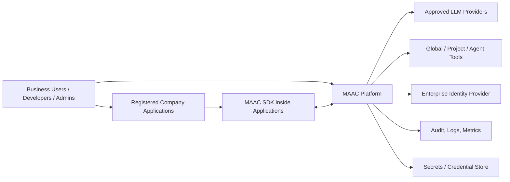

### 5.1 Main External Actors

| Actor | Interaction with MAAC |
|---|---|
| MAAC Admin | Configures platform-level settings, approved LLMs, global tools, governance, and roles. |
| Application Owner | Registers and manages application integrations. |
| Project Owner | Manages projects, agents, and project-level tools. |
| Agent Developer | Creates agents, defines prompts, attaches tools, and tests behavior. |
| Security Reviewer | Reviews tools, model access, data sensitivity, and audit trails. |
| Registered Application | Calls MAAC agents through API/SDK and executes client-side tools when required. |
| Business User | Uses AI capabilities embedded in company applications. |

---

## 6. Architectural Overview

MAAC is composed of six major layers:

1. **Experience Layer** — Web UI, dashboards, playground, and developer screens.
2. **API Layer** — REST APIs and event endpoints used by applications and SDKs.
3. **Agent Runtime Layer** — Orchestrates prompts, model calls, tool calls, run lifecycle, and response generation.
4. **Tool Governance Layer** — Manages tool contracts, tool scopes, execution modes, schemas, and implementation status.
5. **Integration Layer** — SDKs, callbacks, webhooks, polling, and tool result submission.
6. **Platform Services Layer** — Identity, authorization, secrets, logs, metrics, cost tracking, and persistence.

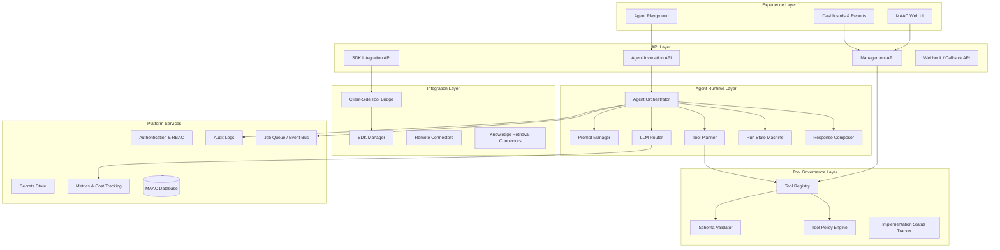

---

## 7. Core Architecture Components

### 7.1 MAAC Web UI

The MAAC Web UI provides administrative, developer, governance, and operational screens.

Responsibilities:

- Application registration
- Project management
- Agent creation and configuration
- Tool contract definition
- LLM catalog management
- SDK implementation center
- Agent playground
- Run logs and audit views
- Governance and approval screens

### 7.2 Agent Runtime

The Agent Runtime is responsible for executing agent runs.

Responsibilities:

- Accept agent invocation requests
- Load agent configuration
- Load prompt, tools, model policy, and runtime settings
- Call approved LLM providers
- Detect required tool calls
- Handle tool execution modes
- Pause and resume runs
- Compose final responses
- Record trace events
- Track usage, latency, and cost

### 7.3 LLM Router

The LLM Router abstracts access to approved model providers.

Responsibilities:

- Enforce allowed model policies
- Route model calls to the selected provider
- Apply model-specific parameters
- Track token usage and cost
- Handle model errors, rate limits, and failover policies
- Support future model routing strategies

### 7.4 Tool Registry

The Tool Registry stores all tool contracts.

Responsibilities:

- Manage global, project-level, and agent-level tools
- Store input and output schemas
- Define execution mode
- Track data sensitivity
- Track approval requirements
- Track implementation status
- Provide tool definitions to the runtime and SDK

### 7.5 Client-Side Tool Bridge

The Client-Side Tool Bridge enables MAAC to request tool execution from the calling application.

Responsibilities:

- Pause agent runs when client-side tool execution is required
- Generate structured tool execution requests
- Wait for tool results from the application
- Validate submitted results
- Resume the agent run
- Handle tool timeouts and failures

### 7.6 MAAC SDK

The MAAC SDK is installed inside registered company applications.

Responsibilities:

- Authenticate application with MAAC
- Discover available agents
- Invoke MAAC agents
- Fetch required client-side tool contracts
- Register local tool handlers
- Execute local handlers when MAAC requests a tool
- Submit tool results back to MAAC
- Support sync, async, polling, or streaming modes

### 7.7 Audit and Observability

Responsibilities:

- Record agent run lifecycle events
- Record model calls
- Record tool calls and tool results according to data retention policy
- Track token usage
- Track cost estimates
- Track latency and error rate
- Provide logs for security, compliance, and debugging

---

## 8. Domain Model Design

### 8.1 Core Entities

| Entity | Purpose |
|---|---|
| Application | A company system registered to integrate with MAAC. |
| Project | Logical workspace for agents and tools, usually related to an application or business domain. |
| Agent | AI capability configured with prompt, model, tools, and runtime settings. |
| LLM Provider | Approved AI provider or model available for use. |
| Tool | Governed capability that agents can use. |
| Tool Contract | Formal definition of a tool's name, schema, scope, execution mode, and policies. |
| Tool Implementation | Application-side implementation status and compatibility record. |
| Agent Run | One execution session of an agent. |
| Tool Call | A specific tool request generated during an agent run. |
| Trace Event | Timeline event created during an agent run. |
| Credential | Authentication details for registered applications and SDKs. |
| Role / Permission | Access control structure for MAAC users. |

### 8.2 Entity Relationship Design

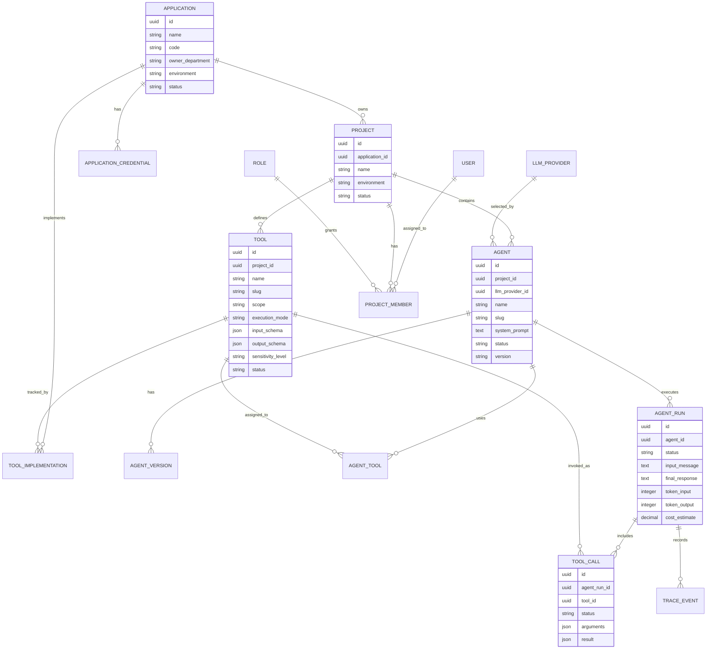

---

## 9. Tool Architecture Design

### 9.1 Tool Scopes

MAAC supports three tool scopes:

| Scope | Description | Example Use |
|---|---|---|
| Global Tool | Available across the platform subject to policy. | Web search, shared document search, notification service. |
| Project-Level Tool | Available to agents within a project. | Project-specific data retrieval or workflow action. |
| Agent-Level Tool | Available only to a specific agent. | A specialized function for a narrow use case. |

### 9.2 Tool Execution Modes

| Execution Mode | Description | Data Boundary |
|---|---|---|
| MAAC-hosted | Tool runs inside MAAC platform. | MAAC-owned execution. |
| Client-side | Tool is executed by the calling application through the SDK. | Application-owned execution. |
| Remote HTTP | MAAC calls an approved internal service endpoint. | Service-owned execution. |
| Connector server | MAAC calls a managed connector service owned by the application/team. | Connector-owned execution. |
| Knowledge retrieval | MAAC retrieves from approved indexed documents or knowledge stores. | MAAC or enterprise knowledge layer. |
| Read-only database view | MAAC reads from approved restricted views, never unrestricted production tables. | Controlled exception. |

### 9.3 Tool Contract Structure

Each tool contract should contain:

```json
{
  "name": "getBusinessRecords",
  "slug": "get_business_records",
  "description": "Retrieves business records based on approved filters.",
  "scope": "project",
  "execution_mode": "client_side",
  "input_schema": {
    "type": "object",
    "properties": {
      "from_date": { "type": "string", "format": "date" },
      "to_date": { "type": "string", "format": "date" },
      "record_type": { "type": "string" }
    },
    "required": ["from_date", "to_date"]
  },
  "output_schema": {
    "type": "object",
    "properties": {
      "records": { "type": "array" },
      "summary": { "type": "object" }
    }
  },
  "data_sensitivity": "internal",
  "requires_approval": false,
  "timeout_seconds": 30,
  "max_payload_kb": 1024
}
```

---

## 10. Client-Side Tool Execution Design

### 10.1 Design Intent

Client-side tool execution allows MAAC agents to request application-specific data or business actions without MAAC directly connecting to application databases.

In this model:

- MAAC defines the tool contract.
- The application implements the tool logic locally.
- The SDK handles communication between the application and MAAC.
- The application enforces local permissions, business rules, and data filtering.
- MAAC validates the tool result shape before resuming the agent run.

### 10.2 Client-Side Tool Sequence

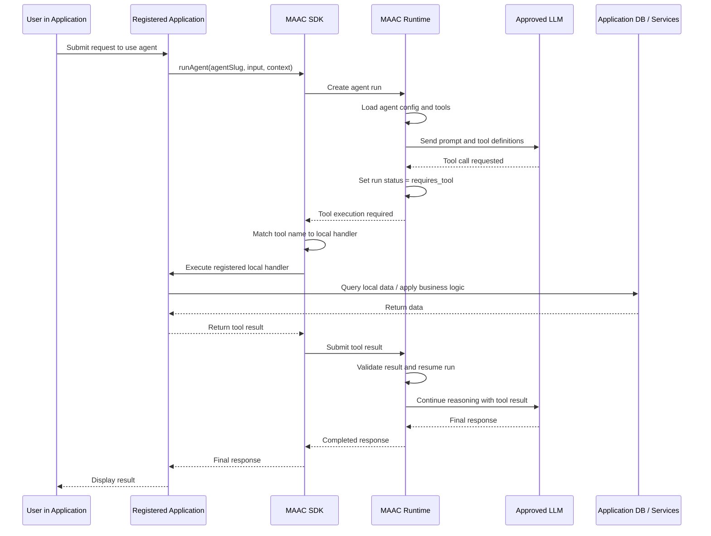

### 10.3 Client-Side Tool State Flow

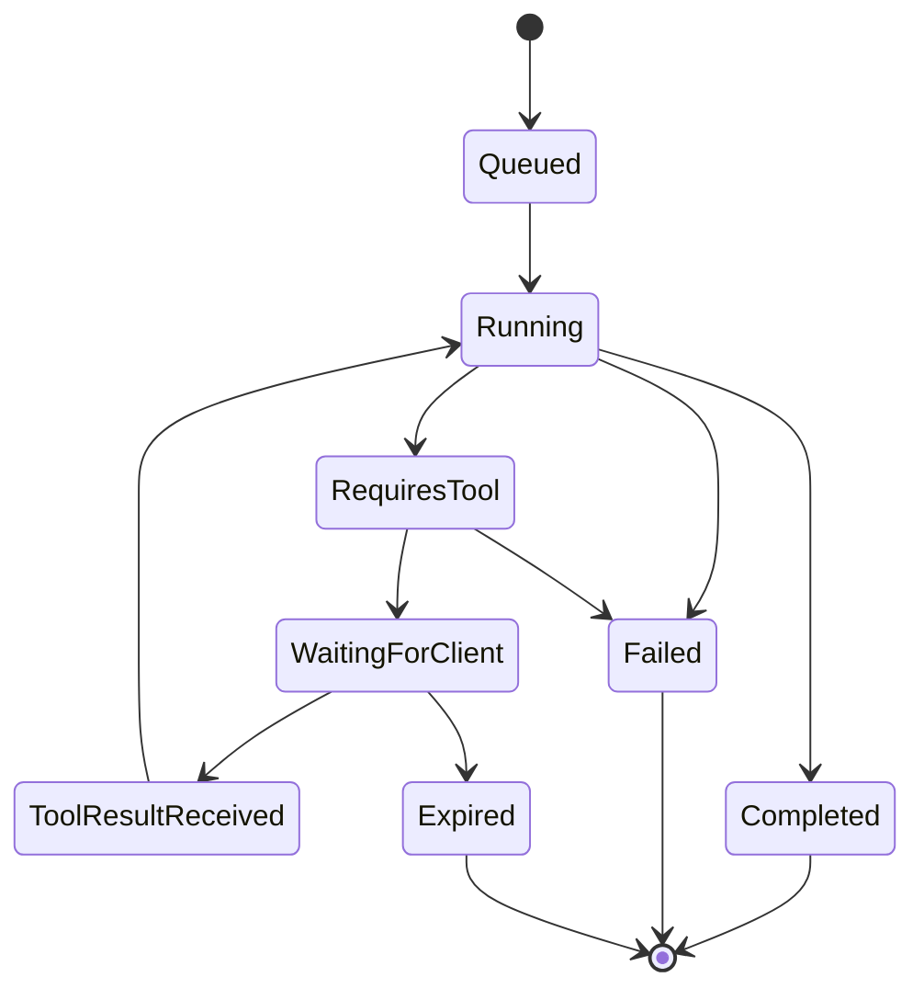

### 10.4 SDK Local Handler Design

The SDK should allow applications to register local handlers for required tools.

Generic pseudocode:

```typescript
maac.registerTool("getBusinessRecords", async (args, context) => {
  // 1. Validate input arguments
  // 2. Validate caller identity and permissions
  // 3. Query local application data or services
  // 4. Apply masking, filtering, and business rules
  // 5. Return result matching MAAC output schema
});
```

Laravel-style pseudocode:

```php
$maac->registerTool('getBusinessRecords', function (array $args, array $context) {
    // Validate arguments
    // Authorize the current user/application context
    // Query local models or services
    // Return safe structured result according to the tool output schema
});
```

### 10.5 Client-Side Tool Implementation Status

MAAC should track implementation status per application and environment.

| Status | Meaning |
|---|---|
| Required | Tool is required by at least one published or test agent. |
| Missing | Application has not registered a compatible handler. |
| Implemented | Application has registered a compatible handler. |
| Outdated | Tool schema changed after the application implementation was registered. |
| Failed Validation | Tool implementation failed schema validation or health check. |
| Not Applicable | Tool is not client-side or does not require application implementation. |

### 10.6 Tool Contract Versioning

Tool contracts should be versioned to avoid breaking application implementations.

Recommended versioning behavior:

- Breaking schema changes create a new major version.
- Non-breaking changes create a minor version.
- Applications report which tool versions they implement.
- MAAC displays compatibility status.
- Old versions can be deprecated with a migration period.

---

## 11. Agent Runtime Design

### 11.1 Agent Run Lifecycle

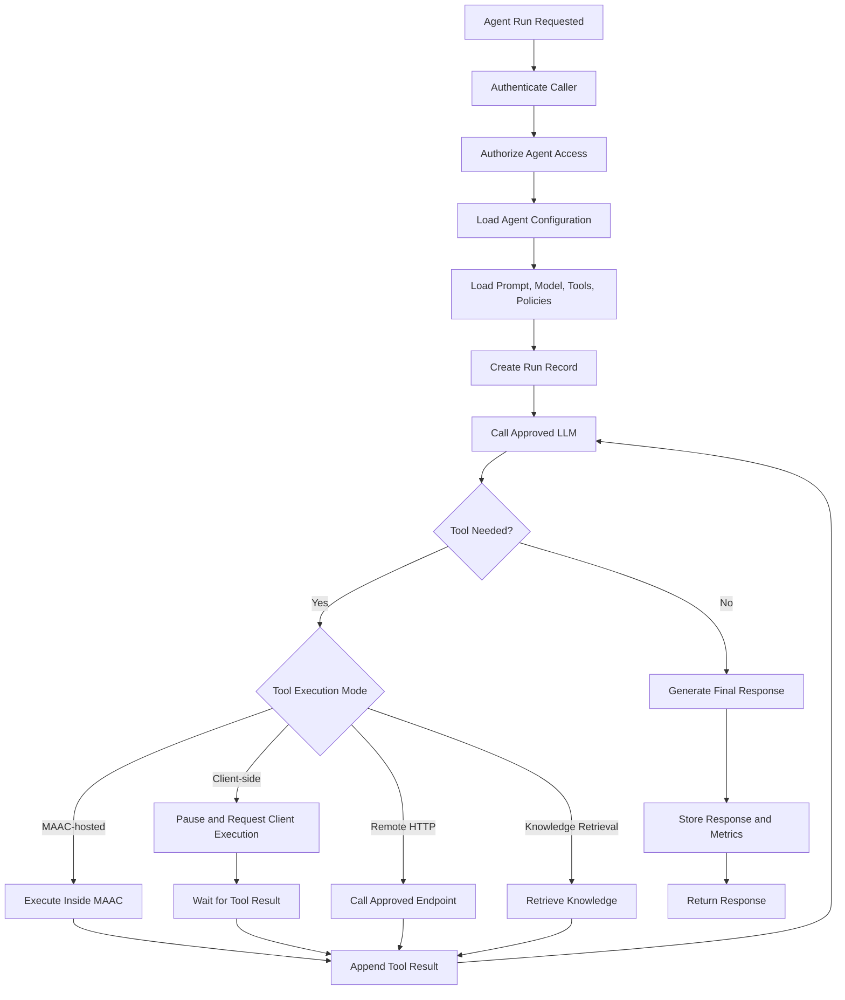

### 11.2 Run Statuses

| Status | Description |
|---|---|
| Queued | Run request received and waiting for processing. |
| Running | Agent runtime is actively processing. |
| Requires Tool | Agent requires a tool call before continuing. |
| Waiting for Client | Runtime is waiting for the calling application to execute a client-side tool. |
| Requires Approval | Run requires human approval before proceeding. |
| Completed | Run completed successfully. |
| Failed | Run failed due to runtime, validation, model, or tool error. |
| Expired | Run waited too long for a tool result or approval. |
| Cancelled | Run was cancelled by user, application, or system. |

### 11.3 Runtime Trace Events

Each agent run should produce trace events such as:

- Run requested
- Caller authenticated
- Agent configuration loaded
- Model selected
- Prompt prepared
- LLM call started
- Tool call requested
- Tool arguments generated
- Client-side tool requested
- Tool result received
- Tool result validated
- LLM call resumed
- Final response generated
- Run completed
- Run failed

---

## 12. SDK Architecture Design

### 12.1 SDK Responsibilities

The SDK provides a standard integration bridge between registered applications and MAAC.

Responsibilities:

1. Authenticate the application using MAAC-issued credentials.
2. Discover agents available to the application.
3. Invoke agents through simple application code.
4. Retrieve required client-side tool contracts.
5. Register local tool handlers.
6. Execute local handlers when requested.
7. Submit tool results to MAAC.
8. Support retries, timeouts, and error reporting.
9. Report implemented tool versions to MAAC.
10. Support synchronous, asynchronous, streaming, or polling runtime modes.

### 12.2 SDK Component Design

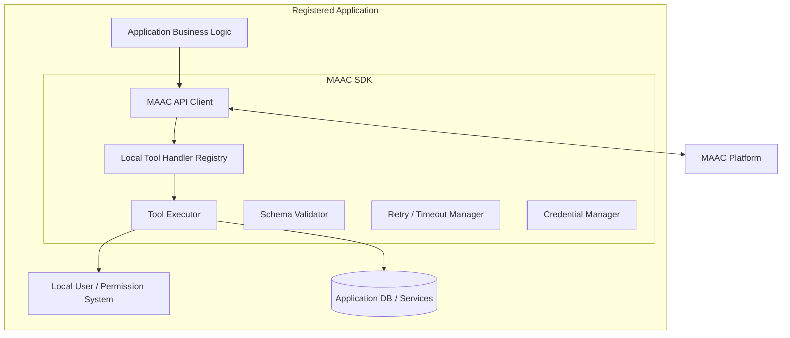

### 12.3 SDK Integration Modes

| Mode | Description | Suitable For |
|---|---|---|
| Simple synchronous mode | Application calls agent and SDK handles tool loop internally. | Standard web application requests. |
| Streaming mode | SDK receives runtime events and streams them to UI. | Chat-style or live progress interfaces. |
| Polling mode | Application polls MAAC for run state changes. | Systems with limited streaming support. |
| Webhook mode | MAAC notifies application when action is required. | Long-running or asynchronous workflows. |

---

## 13. API Design

### 13.1 API Categories

| API Category | Purpose |
|---|---|
| Management API | Used by MAAC UI and admins to manage applications, projects, agents, tools, and models. |
| Agent Runtime API | Used by applications to invoke agents and retrieve run status. |
| SDK Integration API | Used by SDKs to sync manifests, submit tool results, and report implementations. |
| Audit API | Used by dashboards and governance users to inspect runs and events. |

### 13.2 Example Agent Run Request

```http
POST /api/v1/agents/{agent_slug}/runs
Authorization: Bearer <application_token>
Content-Type: application/json
```

```json
{
  "message": "Analyze recent business activity and summarize key findings.",
  "context": {
    "user_id": "user-123",
    "department": "Operations",
    "application": "registered-app-code",
    "environment": "production"
  }
}
```

### 13.3 Example Tool Required Response

```json
{
  "status": "requires_tool",
  "run_id": "run_001",
  "tool_call": {
    "id": "toolcall_001",
    "name": "getBusinessRecords",
    "version": "1.0.0",
    "execution_mode": "client_side",
    "arguments": {
      "from_date": "2026-01-01",
      "to_date": "2026-03-31",
      "record_type": "pending"
    }
  }
}
```

### 13.4 Example Tool Result Submission

```http
POST /api/v1/runs/{run_id}/tool-results
Authorization: Bearer <application_token>
Content-Type: application/json
```

```json
{
  "tool_call_id": "toolcall_001",
  "status": "completed",
  "result": {
    "summary": {
      "total_records": 120,
      "pending_records": 34,
      "exceptions": 6
    },
    "records": []
  }
}
```

### 13.5 Example Final Response

```json
{
  "status": "completed",
  "run_id": "run_001",
  "response": "The analysis identified 34 pending records, with 6 requiring priority attention due to policy exceptions.",
  "usage": {
    "input_tokens": 2300,
    "output_tokens": 460,
    "estimated_cost": 0.037
  }
}
```

---

## 14. Security Architecture

### 14.1 Security Boundaries

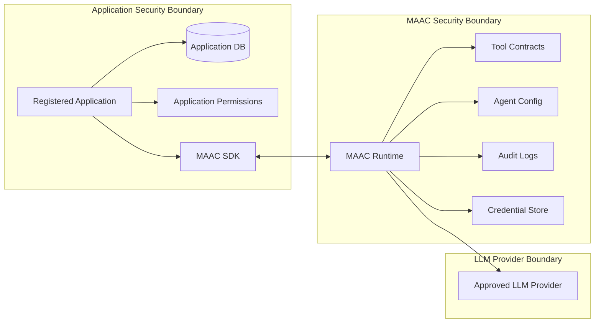

### 14.2 Authentication

Recommended authentication model:

- Enterprise SSO for MAAC Web UI users.
- Application credentials for registered applications.
- Environment-specific client IDs and client secrets.
- Short-lived access tokens for API and SDK calls.
- Optional mutual TLS for high-sensitivity environments.

### 14.3 Authorization

Authorization should be enforced at multiple levels:

| Level | Control |
|---|---|
| Platform | Who can administer MAAC settings. |
| Application | Who can register or manage application integration. |
| Project | Who can create or modify project resources. |
| Agent | Who can edit, publish, test, or invoke agents. |
| Tool | Who can create, approve, assign, or execute tools. |
| Model | Which projects can use which LLMs. |
| Audit | Who can view prompts, responses, tool results, and sensitive logs. |

### 14.4 Data Protection

Recommended data protection controls:

- Classify tools and agent runs by data sensitivity.
- Mask sensitive data before sending to LLMs where required.
- Store secrets in a vault, not in application code or database plaintext.
- Allow configurable retention for prompts, responses, tool inputs, and tool outputs.
- Support redaction policies for audit logs.
- Restrict direct database access; prefer client-side tools or approved APIs.
- Enforce maximum payload sizes and query limits for tool results.

### 14.5 Client-Side Tool Security Controls

For client-side tools:

- Application must authenticate to MAAC.
- MAAC must validate that the tool is assigned to the requesting agent.
- MAAC must validate tool arguments against input schema.
- Application must revalidate permissions locally.
- Application must apply business rules, row filtering, and data masking.
- Application must return data matching the output schema.
- MAAC must validate result size and structure before resuming.
- All tool calls must be auditable.

---

## 15. Observability and Audit Design

### 15.1 Observability Components

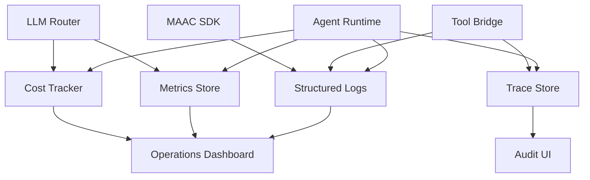

### 15.2 Metrics to Track

| Metric | Purpose |
|---|---|
| Total runs | Platform usage. |
| Successful runs | Reliability and adoption. |
| Failed runs | Error tracking. |
| Runs waiting for client tools | Integration bottleneck visibility. |
| Average latency | Performance monitoring. |
| Token usage | Cost and capacity tracking. |
| Cost estimate | Budget control. |
| Tool call count | Tool usage insight. |
| Tool failure rate | Integration quality. |
| Model usage by project | Governance and cost allocation. |

### 15.3 Audit Event Categories

- User management changes
- Application registration changes
- Credential generation or regeneration
- Project changes
- Agent creation, update, publish, disable
- Tool contract creation or schema change
- Tool implementation status change
- Model catalog changes
- Agent invocation
- Tool call request
- Tool result submission
- Run completion or failure

---

## 16. Deployment Architecture

### 16.1 Logical Deployment View

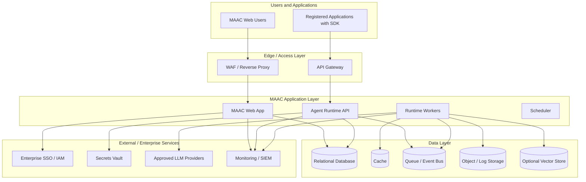

### 16.2 Recommended Runtime Services

| Service | Responsibility |
|---|---|
| Web Application | MAAC UI and management APIs. |
| Agent Runtime API | Handles application/SDK agent invocation. |
| Runtime Workers | Execute asynchronous agent runs and resume paused runs. |
| Scheduler | Handles expirations, retries, cleanup, and scheduled jobs. |
| Queue/Event Bus | Decouples runtime execution from HTTP requests. |
| Relational Database | Stores platform configuration and transactional records. |
| Cache | Speeds up configuration, sessions, and rate limiting. |
| Object Storage | Stores large logs, payload snapshots, or exports if needed. |
| Vector Store | Optional storage for knowledge retrieval and RAG tools. |
| Secrets Vault | Stores LLM keys, application credentials, and integration secrets. |

### 16.3 Environment Design

Recommended environments:

| Environment | Purpose |
|---|---|
| Development | Platform development and internal testing. |
| Sandbox | Application teams test SDK integration and mock agents. |
| Staging | Pre-production validation with approved test integrations. |
| Production | Live business usage with controlled access and audit requirements. |

Each environment should have separate:

- Application credentials
- Agent publication status
- Tool implementation status
- Model access rules
- Logs and retention policies
- Network access policies

---

## 17. UI Information Architecture Design

The UI should support the platform's core journeys: onboarding applications, creating agents, defining tools, implementing tools through SDK, testing agents, and auditing runtime behavior.

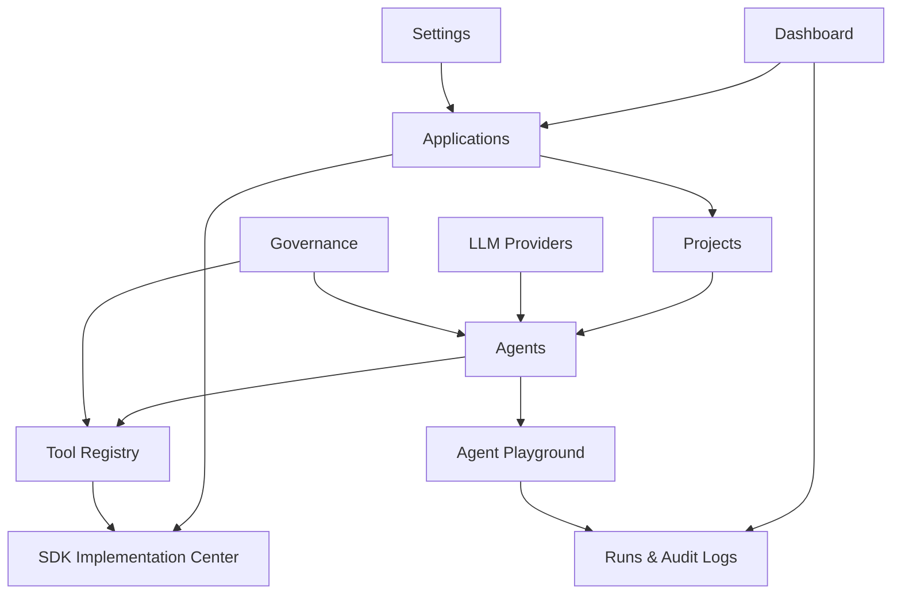

### 17.1 Key UI Screens

| Screen | Purpose |
|---|---|
| Dashboard | Shows platform usage, run status, costs, implementation gaps, and governance alerts. |
| Applications | Registers and manages company application integrations. |
| Projects | Manages project workspaces under applications or business domains. |
| Agents | Creates and manages agent definitions, prompts, models, tools, and versions. |
| Tool Registry | Defines and governs global, project, and agent tools. |
| SDK Implementation Center | Shows developers what client-side tools must be implemented inside applications. |
| Agent Playground | Tests agents and simulates runtime/tool execution. |
| Runs & Audit Logs | Provides traceability of agent execution, tool calls, and model usage. |
| LLM Providers | Manages company-approved models and provider settings. |
| Governance | Handles approvals, roles, permissions, data policies, and review queues. |

---

## 18. Data Flow Designs

### 18.1 Application Registration Flow

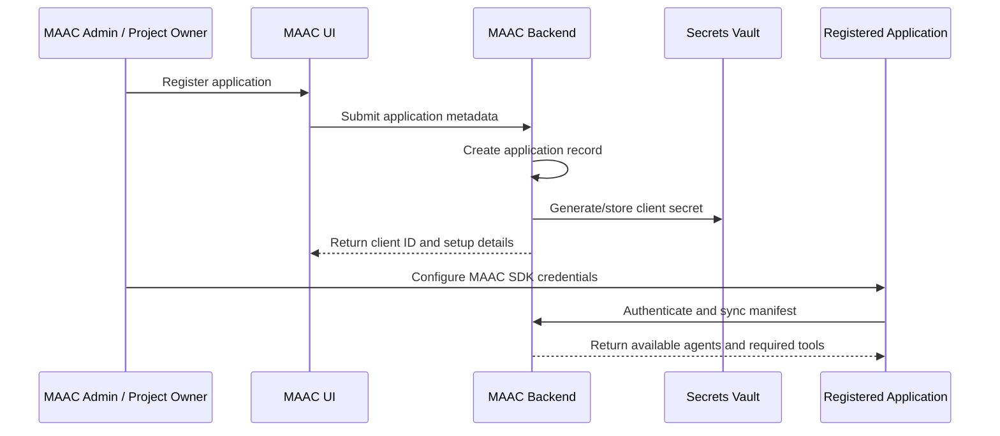

### 18.2 Agent Creation Flow

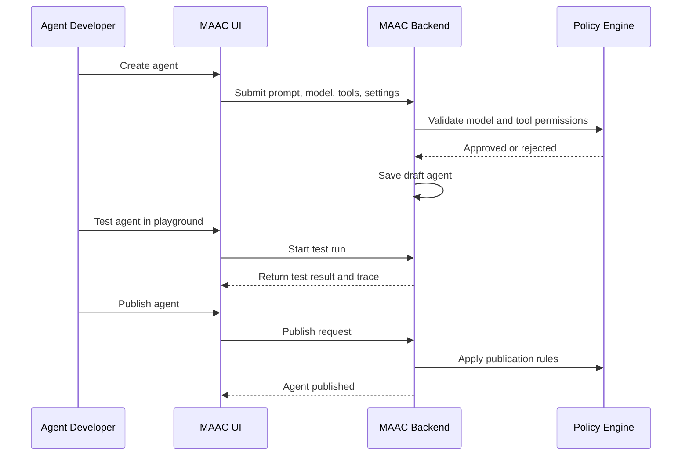

### 18.3 Tool Contract Creation Flow

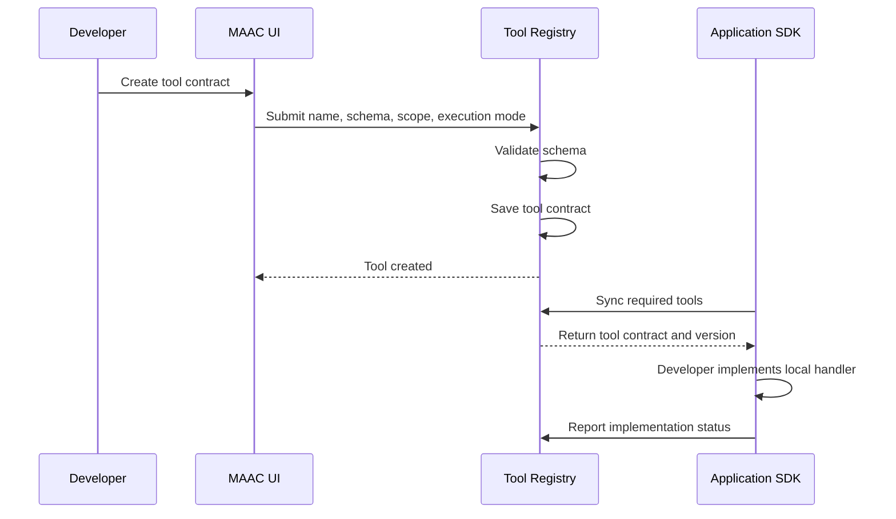

---

## 19. Governance Design

### 19.1 Governance Domains

| Domain | Governance Control |
|---|---|
| Model governance | Approved LLM catalog, model restrictions, cost visibility, sensitivity rating. |
| Tool governance | Tool contract approval, schema validation, execution mode control, deprecation. |
| Agent governance | Draft/testing/published lifecycle, versioning, prompt review, safety settings. |
| Application governance | Registered applications, credentials, scopes, environment separation. |
| Data governance | Data sensitivity levels, retention, masking, logging policies. |
| Operational governance | Run monitoring, failure visibility, rate limits, quotas, incident review. |

### 19.2 Agent Publication Controls

Before an agent is published, MAAC should verify:

- Agent has a valid system prompt.
- Selected LLM is approved for the project/environment.
- Required tools are active and approved.
- Client-side tools have implementation status rules defined.
- Runtime limits are configured.
- Safety settings are configured.
- Required approval has been completed if sensitive tools are used.

---

## 20. Non-Functional Architecture Requirements

| Category | Requirement |
|---|---|
| Availability | MAAC should be designed for high availability in production. |
| Scalability | Runtime workers should scale independently from the Web UI. |
| Security | All API calls must be authenticated and authorized. |
| Auditability | Agent runs and administrative changes must be traceable. |
| Maintainability | Components should be modular and independently extensible. |
| Extensibility | Platform should support additional LLMs, tool types, SDK languages, and integrations. |
| Performance | Common runtime requests should return quickly, while long-running runs should use async flow. |
| Resilience | Tool failures, model failures, and timeouts should be handled gracefully. |
| Compliance | Logging and data retention should support audit and compliance needs. |
| Usability | Developers should clearly understand which tools require application-side implementation. |

---

## 21. Architectural Decisions

| ID | Decision | Rationale |
|---|---|---|
| AD-001 | MAAC is a central platform, not only an SDK. | Central governance, visibility, agent management, and auditability are required. |
| AD-002 | Applications integrate through SDKs and credentials. | Reduces integration complexity and standardizes agent invocation. |
| AD-003 | Tool contracts are created first in MAAC UI. | Provides central governance and visibility before implementation. |
| AD-004 | Client-side tools are implemented in the owning application. | Preserves application data ownership and reduces MAAC database access risk. |
| AD-005 | MAAC should not use unrestricted direct production DB access as the default pattern. | Avoids security, coupling, and governance risks. |
| AD-006 | Agent runs must support pause-and-resume lifecycle. | Required for client-side tool execution and future approval workflows. |
| AD-007 | Runtime workers should be separate from the Web UI. | Improves scalability and reliability. |
| AD-008 | Tools must have input/output schemas. | Enables validation, SDK generation, governance, and safe execution. |
| AD-009 | Tool contracts and implementations must be versioned. | Prevents breaking integrated applications. |
| AD-010 | Observability is a core platform capability. | Required for enterprise trust, debugging, compliance, and cost control. |

---

## 22. Risks and Mitigations

| Risk | Impact | Mitigation |
|---|---|---|
| Application teams do not implement required tools correctly. | Agents may fail at runtime. | Provide SDK stubs, schema validation, implementation status dashboard, and test tools. |
| Tool schemas change and break application implementations. | Production failures. | Use versioning, compatibility checks, deprecation windows, and environment testing. |
| Sensitive data sent to LLM unintentionally. | Compliance and security risk. | Apply sensitivity classification, masking, policy checks, and logging controls. |
| Long-running tool callbacks cause poor UX. | Delays and timeouts. | Support async mode, polling, webhooks, timeouts, and progress events. |
| Too much raw data returned from tools. | High cost, poor performance, data risk. | Enforce max payloads, summarization tools, pagination, and aggregation-first design. |
| Over-centralization of platform ownership. | Slow adoption. | Allow project owners and application owners to self-serve within governance limits. |
| Multiple LLM providers increase complexity. | Operational overhead. | Abstract through LLM Router and maintain approved provider catalog. |
| Insufficient audit detail. | Compliance weakness. | Define trace event standards and retention policies from the start. |

---

## 23. Recommended Implementation Phases

### Phase 1: Prototype / Business Demonstration

Focus:

- UI prototype
- Mock data
- Agent/project/tool management screens
- SDK Implementation Center concept
- Mock agent playground
- Simulated client-side tool execution
- Mock run trace and audit logs

### Phase 2: Technical MVP

Focus:

- Real backend persistence
- Application registration and credentials
- Agent creation and runtime API
- Approved LLM integration
- Tool contract registry
- Basic SDK
- Client-side tool execution
- Run logs and trace events

### Phase 3: Enterprise Readiness

Focus:

- SSO and RBAC
- Secrets vault integration
- Production-grade audit logging
- Approval workflows
- Cost tracking
- Monitoring and alerting
- Rate limits and quotas
- Environment separation

### Phase 4: Advanced Capabilities

Focus:

- Connector servers
- Knowledge retrieval and RAG tools
- Multi-agent orchestration
- Evaluation lab
- Workflow automation
- Human-in-the-loop approvals
- Advanced model routing
- SDKs for multiple languages

---

## 24. Open Architecture Questions

The following questions should be resolved before final implementation:

1. Which identity provider will be used for MAAC Web UI authentication?
2. Which LLM providers and deployment models are approved for the first release?
3. Which programming languages should the MAAC SDK support first?
4. Should SDK integration support streaming in the first release or only request/response and polling?
5. What retention policy should apply to prompts, tool inputs, tool outputs, and final responses?
6. Should client-side tool results be stored fully, partially, redacted, or not stored by default?
7. Which environments must be supported in the first production release?
8. What is the approval process for publishing agents that use sensitive tools?
9. Should MAAC support direct read-only database views in the first release or defer this to a later phase?
10. Which monitoring, SIEM, or log aggregation tools should MAAC integrate with?

---

## 25. Appendix A: Example Navigation Structure

```text
MAAC
├── Dashboard
├── Applications
│   ├── Application Detail
│   ├── Credentials
│   ├── SDK Setup
│   └── Required Tools
├── Projects
│   ├── Project Detail
│   ├── Agents
│   └── Project Tools
├── Agents
│   ├── Agent Detail
│   ├── Create Agent Wizard
│   ├── Versions
│   ├── Runtime Settings
│   └── Playground
├── Tools
│   ├── Tool Registry
│   ├── Tool Detail
│   ├── Schemas
│   └── SDK Stub Generator
├── SDK Implementation Center
├── Agent Playground
├── Runs & Audit Logs
│   ├── Run List
│   └── Run Trace Detail
├── LLM Providers
├── Governance
│   ├── Roles
│   ├── Permissions
│   ├── Approvals
│   └── Data Policies
└── Settings
```

---

## 26. Appendix B: Recommended Prototype Screens

For a business-facing architecture/demo prototype, the following screens should be designed:

1. Dashboard
2. Application Registry
3. Application Detail
4. Project List
5. Project Detail
6. Agent List
7. Agent Detail
8. Create Agent Wizard
9. Tool Registry
10. Tool Detail
11. SDK Implementation Center
12. Agent Playground
13. Runs & Audit Logs
14. Run Trace Detail
15. LLM Providers
16. Governance
17. Settings

---

## 27. Conclusion

The proposed MAAC architecture provides a strong enterprise foundation for safe, governed, and reusable AI agent adoption. The design separates orchestration from application-owned execution, allowing MAAC to manage agents, prompts, tools, LLMs, governance, and auditability while preserving application-level control over data access and business rules.

The Client-Side Tool Execution Pattern is the most important design choice for integrating isolated applications. It allows MAAC to request capabilities from applications without directly accessing their databases. Combined with SDK integration, tool contract versioning, runtime observability, and strong governance, MAAC can become a scalable enterprise AI agent center for internal applications.
