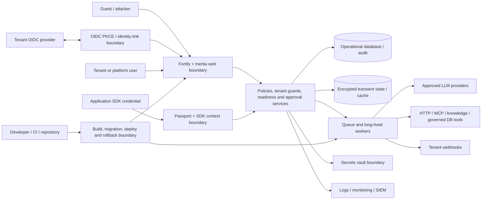

# MAACC Phase 1 Threat Model and Control Register v1

**Artifact status:** Produced for Phase 1 engineering review; formal G0/G1/G3 approval pending
**Scope:** Entire MAACC repository and intended central internal-platform deployment
**Evidence date:** 15 July 2026
**Source baseline:** [`MAACC_BRS(1).md`](../MAACC_BRS(1).md), [`MAACC_Architecture_Document.md`](../MAACC_Architecture_Document.md), the [enterprise-readiness review](../MAACC_Enterprise_Readiness_Review_2026-07-11.md), and current implementation/tests
**Required approvers:** Product/Platform Owner, Security/IAM, Privacy/Compliance, Architecture, Engineering, and SRE

This document is an engineering-produced baseline. It identifies assets, actors, trust boundaries, attacker-controlled inputs, invariants, data classes, risks, control owners, and evidence. It does not represent acceptance by the named owners; unsigned decisions and target-environment proof remain release blockers.

## Overview

MAACC is a multi-tenant internal AI-agent platform. Human users manage applications, projects, agents, model providers, tools, approvals, governance, enterprise identity, secrets, incidents, and audits through a Laravel/Inertia console. Registered applications authenticate with Passport client credentials and use a versioned SDK/runtime API to fetch manifests, invoke published agents, submit client-tool results, stream or poll runs, and manage webhooks. Runtime workers can call approved LLM providers and execute hosted, HTTP, MCP, knowledge, and governed database tools.

The assets with the highest security impact are:

- Global platform-administrator identities and time-boxed break-glass grants.
- Tenant membership, project roles, SSO identities, application credentials, sessions, and Passport tokens.
- Provider, webhook, connector, database, and application secrets plus their vault references.
- Agent prompts, configurations, immutable version hashes, approvals, model/tool assignments, and publication state.
- Run inputs, outputs, tool arguments/results, transient state, traces, audit records, exports, and caller context.
- Tenant provider billing boundaries, quotas, usage/cost attribution, and production availability.
- Release artifacts, deployment credentials, signing keys, repository history, and acceptance evidence.

The principal security objectives are:

1. Preserve tenant, parent, application, project, environment, and actor boundaries on every read, write, background, import/export, manifest, and runtime path.
2. Prevent a tenant-controlled IdP or external subject from linking to, authenticating as, or inheriting a global privileged account.
3. Ensure restricted/confidential values are never persisted or emitted where effective policy says `exclude`, and are masked consistently where policy says `mask`.
4. Ensure one tenant never observes, uses, or is billed through another tenant's provider credential, including overlapping long-lived-worker execution.
5. Prevent publication, manifest exposure, evaluation, playground, start/resume, and jobs from bypassing the authoritative readiness and four-eyes approval state machine.
6. Fail closed with stable public errors and correlation IDs while retaining sufficient sanitized evidence for Security/IAM and SRE response.

## Threat Model, Trust Boundaries, and Assumptions

### Actors and control levels

| Actor | Control level | Relevant capabilities and constraints |
| --- | --- | --- |
| Unauthenticated internet/internal-network caller | Attacker-controlled | Can reach public entry, Fortify authentication, SSO redirect/callback, and OAuth endpoints; can manipulate paths, query strings, state, callback codes, timing, and request volume. |
| Tenant web user | Partially attacker-controlled | Has a valid web session and a tenant/project role; may submit IDs, configurations, schemas, prompts, URLs, files, approval subjects, and route parameters. Must remain inside the selected tenant and granted capabilities. |
| Dual-tenant member | Partially attacker-controlled | Legitimately belongs to multiple teams. Switching current context must never authorize objects from another team implicitly. |
| Registered application / SDK client | Partially attacker-controlled | Holds one application/environment credential and controls runtime input, caller context, client-tool results, polling, streaming, webhook registration, retries, and idempotency behavior. |
| Tenant-controlled OIDC provider | Untrusted external authority | Controls authorization responses and identity/group claims for one approved connection. It is not trusted to identify existing global users or grant platform roles. |
| Platform operator / Security reviewer / Release manager | Operator-controlled | Can perform explicitly global administration, approval, incident, audit, or release duties according to server-issued permissions and separation-of-duty rules. |
| Super Admin / break-glass operator | Highly privileged operator-controlled | Has emergency platform authority. Local authentication, time-boxing, reason, audit, expiry, and later review are mandatory. |
| LLM, MCP, HTTP tool, knowledge, database, webhook, vault, IAM, and monitoring service | External/operator-controlled | Responses, errors, latency, availability, redirects, DNS, and payload sizes are not inherently trusted. Destination and credential policy must be enforced by MAACC. |
| Queue worker, scheduler, cache, database, object storage | Platform-controlled runtime | May be long lived, retried, duplicated, delayed, or partially unavailable. Tenant context and secrets must not leak through process globals, singleton state, caches, or serialized jobs. |
| Developer, CI, dependency, and repository administrator | Developer/operator-controlled | Can affect source, dependencies, build outputs, migrations, secrets, and deployments. Protected review, reproducibility, provenance, and secret hygiene are assumed but require external evidence. |

### Repository-wide trust boundaries

| ID | Boundary | Untrusted inputs crossing it | Required invariant / control |
| --- | --- | --- | --- |
| TB-01 | Guest browser → web authentication | Credentials, cookies, CSRF state, rate, redirects | Fortify protections, encrypted sessions, session rotation, dedicated rate limits, generic failure responses. |
| TB-02 | Tenant IdP → SSO callback | State, code, signed token, issuer, subject, email, domains, groups, key set | PKCE, single-use state, 10-minute TTL, pinned JWKS, algorithm/signature/issuer/audience/azp/expiry/nonce validation, verified email, exact issuer/subject identity, no email auto-link, no platform-admin inheritance. |
| TB-03 | Tenant web request → domain/database | Route objects, relationship IDs, selected team, roles, schemas, status | Resolve objects first; authorize parent/object; enforce `TenantRelationshipGuard`, scoped validation, composite constraints, legal transitions, and server-issued permissions. |
| TB-04 | Application SDK → runtime | OAuth client, agent/run IDs, inputs, caller, tool results, webhook operations | Passport resource-owner check, `SdkContext`, application-scoped lookups, readiness gate, schema/size checks, stable errors, correlation and idempotency provenance. |
| TB-05 | Runtime → LLM provider | Prompt, tools, model, API key, timeout, provider response/error | Approved model/environment, tenant vault binding or explicit platform ownership, uncached request-scoped provider instance, governed payload, bounded timeout, redacted errors. |
| TB-06 | Runtime → tools/data/knowledge/connectors | Model-generated arguments, URLs, queries, connector IDs, result payloads | Assignment/readiness checks, schema projection, destination policy, read-only DB allowlist, payload/time limits, result validation and retained-boundary policy. |
| TB-07 | HTTP process → queue/cache/worker | Serialized job data, tenant IDs, retries, transient state, singleton/process state | Identifier-only encrypted jobs, tenant-scoped encrypted state keys/TTL, idempotent/locked transitions, no process-global credentials, retry-safe redaction. |
| TB-08 | Runtime → webhook consumer | Event body, endpoint, signature, retry/error details | Application-scoped endpoints, HTTPS/egress policy, signing key isolation/rotation, bounded delivery, redacted traces and controlled replay. |
| TB-09 | Application → vault | Secret material, vault reference, actor/environment | Encrypted storage/external-vault contract, no plaintext serialization, staged high-risk mutation, access audit, explicit tenant ownership. |
| TB-10 | Domain → audit/log/export/SIEM | Actor, target, payload metadata, exceptions, identity failures | Apply mask/exclude before each copy, stable codes and correlation IDs, tenant-scoped exports, protected immutable target in later phases. |
| TB-11 | Repository/CI → deployed web and workers | Source, dependencies, migrations, generated artifacts, secrets | Review, deterministic install, non-mutating aggregate CI, secret/history review, protected required checks, immutable deploy and rollback evidence. |

### Security invariants

- Every relationship-bearing object must belong to the selected team, approved parent/application/project, and correct environment before persistence or execution.
- A global platform role does not turn a tenant runtime credential into a cross-tenant credential; global access is limited to explicit administration surfaces.
- External identity is keyed by exact connection/issuer and subject. Email alone can never attach a new external identity to an existing account.
- A tenant IdP cannot authenticate an existing platform administrator or grant platform roles outside an explicitly governed platform process.
- SSO connection creation, test, approval, activation, modification, disablement, failures, anomalies, and break-glass recovery are audited; creator and approver must differ.
- `AgentReadinessGate` is authoritative for publish, approval, manifest, evaluation, playground, runtime start/resume, and jobs; material changes invalidate version-bound approval.
- Provider credentials are request scoped. Tenant-owned providers require a vault binding; environment fallback is limited to explicitly platform-owned providers.
- `PayloadHandling::Exclude` means no retained or outbound copy; restricted failures expose only stable public codes/correlation IDs.
- Queue, cache, trace, webhook, export, browser, and log copies may not weaken the effective data policy applied to the source payload.
- A suspended/archived application or inactive/foreign model, tool, connector, source, implementation, approval subject, or quota subject fails closed before outward effects.

### Assumptions requiring owner confirmation

- MAACC is a central internal platform but public repository and network exposure decisions are not yet approved.
- Production uses managed database, cache/rate-limit, queue, object storage, Passport keys, external vault/KMS, monitoring/SIEM, and protected deployment services; current checkout cannot prove their configuration.
- Application teams remain responsible for end-user authorization and minimization inside client-side tools.
- Approved providers, destinations, models, environments, retention/legal-hold policy, SLO/RPO/RTO, currency, and data residency will be frozen in approved BRS/ADRs.
- Local Super Admin authentication is enrolled with phishing-resistant MFA/passkeys, stored outside the tenant IdP dependency, monitored, periodically exercised, and restricted to named custodians. This remains an operational acceptance item.

## Attack Surface, Mitigations, and Attacker Stories

| Surface / attacker story | Impact | Current Phase 1 mitigation | Residual requirement |
| --- | --- | --- | --- |
| Tenant A submits Tenant B application/provider/tool/approval/quota IDs | Cross-tenant mutation or execution | Central relationship guard, scoped requests/actions, selected-team middleware, composite constraint, two-tenant matrix, integrity scanner | Run scanner in every real environment and independently review matrix/constraints. |
| Dual member uses a Tenant B slug below Tenant A route | Direct-object read/write leak | Implicit binding plus selected-team ownership middleware; detail-route regression tests | Extend matrix whenever a new detail/import/export route is added. |
| Malicious IdP claims a privileged user's email | Platform account takeover | Signed OIDC validation, exact subject identity, email-collision rejection, platform-admin rejection, verified email/domain, staged connection activation | Audit existing real identities/sessions and revoke suspicious links/sessions. |
| Callback replay, mix-up, nonce/state tampering, invalid signature, or brute force | Login bypass or identity confusion | PKCE, single-use state, flow TTL, pinned connection/JWKS, claim validation, dedicated limiter, stable failure codes, durable anomaly events | Deliver High events to SIEM/on-call and exercise alert thresholds in staging. |
| IdP outage blocks administrators | Operational lockout | Controlled availability failure, tenant alert, local Super Admin login, audited time-boxed break-glass grant | Verify local MFA custodians, outage runbook, recovery/expiry, and notification in target environment. |
| Worker handles Tenant B after Tenant A and reuses provider key | Cross-tenant spend/data leak | Request-scoped uncached provider construction, tenant vault requirement, sequential and Fiber-overlap A/B tests | Verify Octane/queue target topology, cache and provider telemetry under load. |
| Restricted prompt/tool result is copied before masking/exclusion | Privacy breach | Encrypted transient store, pre-boundary redactor, explicit `store/mask/exclude`, identifier-only jobs, recursive sentinel tests | Prove absence in real logs, SIEM, failed-job store, backups, exports, and vendor telemetry. |
| User sets Published or approves their own already-applied change | Governance bypass | Ordinary payloads exclude privileged state; unified readiness gate, immutable hash, four-eyes, locks, unique pending request, staged credential/model changes | Independent acceptance of policy decisions and hosted race evidence. |
| Model generates undeclared tool fields, unsafe URL, or oversized result | SSRF, injection, excessive disclosure | Schema validation/projection and existing endpoint rules/limits | Unified Phase 2 egress/DNS/redirect policy and all-mode bounded reads remain required. |
| Runtime/API error exposes provider, DB, tool, or validation details | Secret/topology disclosure | Stable SDK errors and correlation IDs; SSO generic correlated response; sanitized audit/log metadata | Validate external APM/log scrubbing and support-only detail access. |
| Repository history or CI artifact contains credentials/local paths | Secret or privacy exposure | Current tracked Graphify metadata removed; portability check green | Repository owner must decide visibility, scan history/artifacts, rotate exposed material, and preserve evidence. |

### Out-of-scope or reduced-likelihood stories

- Direct compromise of an approved LLM, IAM, vault, cloud control plane, or dependency registry is not solved solely by this repository. MAACC must minimize credentials/data, verify responses where possible, restrict destinations, monitor failures, and rely on vendor/cloud controls with contractual assurance.
- Malicious behavior inside an application-owned client-side tool is outside MAACC's direct database boundary. MAACC validates contracts and retained data, but the consuming application must reauthorize its user, filter rows/fields, and minimize results.
- Physical endpoint compromise and corporate-network identity proofing are operational controls outside the source tree; they still influence whether local break-glass and administrator sessions are trustworthy.

## Severity Calibration (Critical, High, Medium, Low)

| Severity | Repository-specific calibration and examples |
| --- | --- |
| Critical | Unauthenticated or ordinary-tenant compromise of a global Super Admin; cross-tenant bulk secret/data access; arbitrary production code/tool execution across tenants; tenant provider keys reused broadly without interaction. A verified email-only SSO takeover of a global administrator would be Critical. |
| High | Cross-tenant object attachment/read/execution; one tenant using another's provider credential; prohibited restricted data persisted or emitted; readiness/approval bypass into production; SSRF to cloud metadata/internal control planes; unsigned/wrong-issuer token accepted. |
| Medium | Tenant-scoped denial of service, bounded audit/metadata disclosure, stale approval that cannot execute without another control failure, repeated SSO failures without account compromise, or an IdP outage with a working tested break-glass path. |
| Low | Non-sensitive information disclosure, noisy but bounded logging, missing UX feedback without authorization impact, or a defense-in-depth weakness requiring a trusted operator and leaving complete audit evidence. |

Severity may increase when exploitation is unauthenticated, cross-tenant, persistent, affects production secrets/privilege, or evades audit. It may decrease when the path is unreachable in deployment, requires a separately compromised trusted operator, is limited to synthetic data, and is blocked by an independently verified control.

## Data Inventory

| Data class | Examples | Main sources and stores | Permitted processing / egress | Protection and retention status | Accountable owner |
| --- | --- | --- | --- | --- | --- |
| Public | Product labels, public SDK contract/version, non-tenant documentation | Source/docs, public entry, SDK descriptor | Browser and documented SDK consumers | Integrity/version control; no sensitive retention concern | Product + SDK Owner |
| Internal | Tenant/application/project names, agent/tool/model metadata, statuses, non-sensitive metrics | Relational DB, Inertia props, manifest, audit metadata | Authorized tenant console, application manifest, operations dashboards | Tenant scoping and role filtering; retention decision pending BRS/ADR | Product + Data Owner |
| Confidential | System/user prompts, model responses, tool arguments/results, caller context, run traces, evaluation cases, documents/chunks | Encrypted transient cache, relational records, queue identifiers, traces, optional webhooks/providers | Only approved model/tool/provider/application boundaries under effective policy | Per-category retention exists; `store/mask/exclude` enforced in code; real log/SIEM/deletion/legal-hold proof pending | Privacy/Compliance + Tenant Data Owner |
| Restricted — identity | Email, issuer/subject, group claims, raw identity claims, session attribution, IP, platform grants | Users, SSO identities, encrypted sessions, audit events, platform-access ledger | IAM validation, entitlement reconciliation, incident/access review | Exact-link controls and sanitized failure events implemented; privileged identity/session audit pending | Security/IAM |
| Restricted — secrets | Application client secrets, provider keys, webhook/MCP/HTTP/DB credentials, OIDC client secret, Passport/signing/session/app keys | Vault reference/encrypted columns, environment/KMS, one-time secret handoff | Resolved only for the authorized operation and environment | Plaintext hidden/encrypted and request scoped; external vault/KMS, rotation, history exposure, backup/key escrow proof pending | Security + SRE + Repository Owner |
| Restricted — governance evidence | Approval payloads/hashes, audit exports, incident actions, security anomaly records | Relational DB, export artifact, monitoring/SIEM target | Named approvers, auditors, incident responders | Version binding and tenant exports implemented; immutable/WORM signature/legal hold remain later-phase controls | Security + Privacy/Compliance |

No owner may infer approval from this inventory. Data residency, retention duration, deletion lag, legal hold, backup inclusion, external processor list, and DPA/contract requirements must be approved in BRS/ADRs before real sensitive-data onboarding.

## Risk Register

| Risk ID | Risk | Inherent severity | Current control / evidence | Residual status and required decision | Owner |
| --- | --- | --- | --- | --- | --- |
| P1-R01 | Cross-tenant relationship or direct-object injection | Critical | Guard, constraints, scanner, and two-tenant tests | Engineering-controlled paths closed locally; target-environment scan and independent review pending | Engineering + Security |
| P1-R02 | Tenant IdP account takeover or privileged role inheritance | Critical | OIDC validation, no email auto-link, privileged collision rejection, staged approval, negative suite | Existing identity/session population has not been audited in real environments | Security/IAM |
| P1-R03 | Sensitive data survives masking/exclusion in a duplicate copy | High | Encrypted transient state, boundary redactor, payload handling policy, sentinel tests | External logs/SIEM/failed jobs/backups and legal-hold/deletion evidence pending | Privacy/Compliance + SRE |
| P1-R04 | Tenant provider credential leaks through a long-lived process | Critical | Request-scoped provider factory, vault requirement, A/B Fiber tests | Target worker/load telemetry and external billing reconciliation pending | Engineering + SRE |
| P1-R05 | Publication/runtime bypasses approval/readiness | High | Unified readiness gate, immutable version hash, four-eyes, staged mutations, concurrency tests | Hosted race/branch protection evidence and owner acceptance pending | Product + Security + Engineering |
| P1-R06 | Existing repository/history/artifact exposes secret or local metadata | High | Current tracked local Graphify metadata removed | Visibility decision, historical secret scan, rotations, and residual acceptance pending | Repository Owner + Security |
| P1-R07 | IdP outage or anomaly leaves platform inaccessible or unobserved | High | Stable codes, durable anomaly/outage audit, console alert, local break-glass test | SIEM/on-call delivery and target-environment outage exercise pending | Security/IAM + SRE |
| P1-R08 | BRS/architecture decisions remain contradictory or unsigned | High | Remediation plan and this baseline register | BRS v1, ADR set, SLO/RPO/RTO, retention, environment, currency, schema/status decisions pending | Product + Architecture + Security + Privacy |
| P1-R09 | Current dirty checkout passes while a clean/hosted gate fails | High | Local aggregate CI and build green | Fresh checkout/frozen install, required hosted check, and branch protection evidence pending | Engineering Lead |
| P1-R10 | Acceptance evidence is self-approved or incomplete | High | Phase ledger distinguishes implemented/local/accepted | G0, Phase 1 G1/G3/G5 signatures remain pending | Named gate owners |

## Control Owner and Evidence Register

| Control area | Accountable role | Responsible role(s) | Current evidence | Acceptance evidence still required |
| --- | --- | --- | --- | --- |
| Onboarding and enterprise-status freeze | Product/Platform Owner | Product Operations | Phase plan records NO-GO | Dated notice, exception process, named change owner |
| Tenant/parent integrity | Security/IAM | Backend Engineering + Data Owner | `TenantRelationshipGuard`, scanner, constraints, two-tenant matrix | Staging/production JSON scans, quarantine record, Security sign-off |
| Enterprise identity and linking | Security/IAM | Backend Engineering + IAM Operations | OIDC/SSO suites, lifecycle audit, anomaly recorder, break-glass test | Privileged identity/session review, alert delivery, outage exercise, custodian record |
| Data classification, retention, and exclusion | Privacy/Compliance | Backend Engineering + SRE | `RunStateStore`, `RunRedactor`, governance settings, sentinel suites | Approved schedule, legal hold/deletion/restore, external-log/SIEM proof |
| Provider/vault isolation | Security | Backend Engineering + SRE | Request-scoped provider factory and A/B overlap tests | External vault/KMS and rotation evidence; worker/load/billing proof |
| Readiness, publication, and approval | Product/Platform Owner | Security Reviewer + Release Manager + Engineering | `AgentReadinessGate`, approval/version/concurrency suites | Policy/ADR approval and hosted release evidence |
| Repository and supply-chain containment | Repository Owner | Security + Engineering Lead | PR #51 Graphify portability fix; local scans/checks | Visibility decision, history/secret review, rotations, protected required checks |
| Threat model and risk register | Security | Architecture + Engineering + Privacy | This artifact | Named reviewers, decision dates, accepted residual risks |
| Phase 1 engineering gate | Engineering Lead | Backend/Frontend/SDK Engineering | Pint, PHPStan, ESLint, Prettier, TypeScript, SDK tests/fixtures, Pest, build | Fresh clone/frozen install and required hosted run/branch protection |
| Enterprise gate decision | Product/Platform Owner | G0/G1/G3/G5 approvers | Phase completion ledger and evidence pack | Signed gate record with links, exceptions, expiry, and residual-risk decision |

## Approval Record

| Role | Named approver | Decision | Date | Conditions / residual risk |
| --- | --- | --- | --- | --- |
| Product/Platform Owner | _Pending_ | _Pending_ | _Pending_ | BRS/ADR and onboarding-status decision required |
| Security/IAM | _Pending_ | _Pending_ | _Pending_ | Identity/session audit, real scans, alert/outage exercise required |
| Privacy/Compliance | _Pending_ | _Pending_ | _Pending_ | Data inventory, retention, legal hold/deletion and external sinks required |
| Architecture | _Pending_ | _Pending_ | _Pending_ | Trust boundaries, environment model, SLO/RPO/RTO required |
| Engineering Lead | _Pending_ | _Pending_ | _Pending_ | Clean checkout and hosted required checks required |
| SRE/Operations | _Pending_ | _Pending_ | _Pending_ | Monitoring/on-call, vault, worker, rollback and recovery evidence required |

Until these approvals and their required artifacts are linked, this threat model is **produced but not accepted**, Phase 1 remains **engineering-verified / acceptance-blocked**, and enterprise production or real sensitive-data onboarding remains **NO-GO**.
